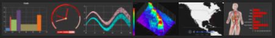
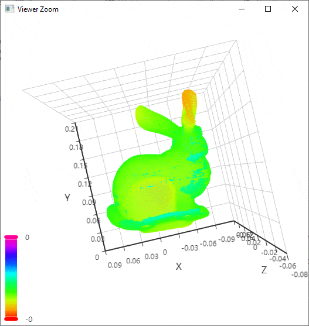
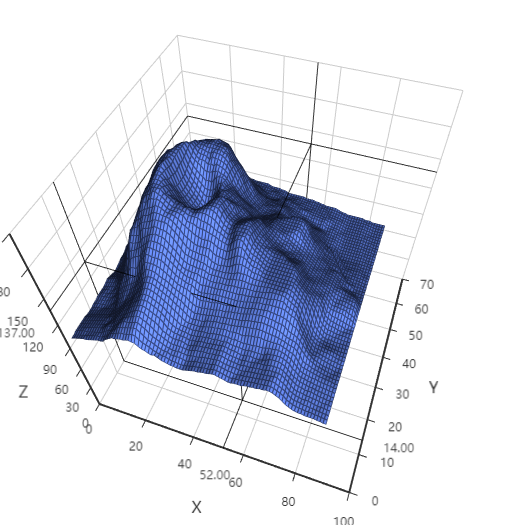
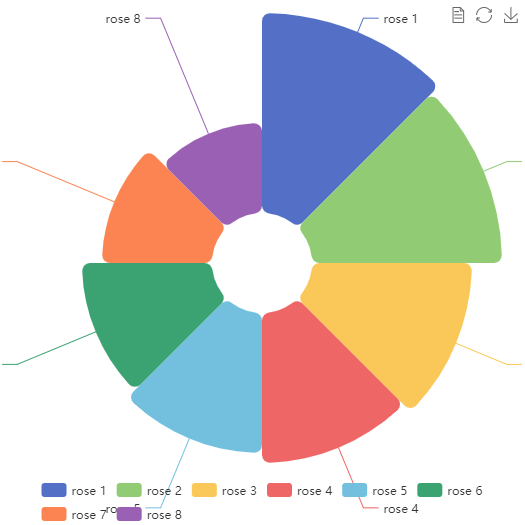
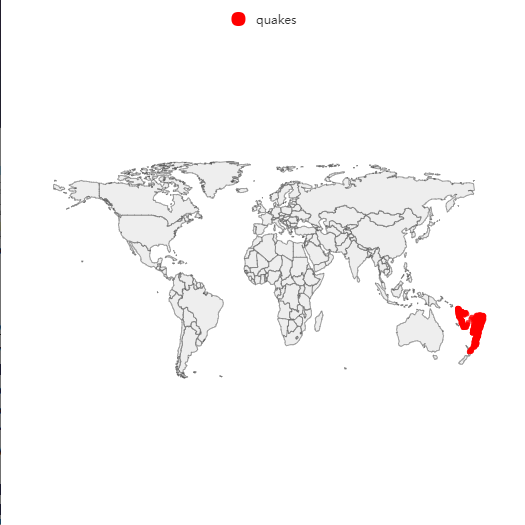
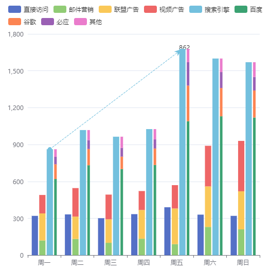

<!-- README.md is generated from README.Rmd. Please edit that file -->

# echarty

<!-- badges: start -->

[](https://github.com/helgasoft/echarty/actions/workflows/R-CMD-check.yaml)
[](https://github.com/helgasoft/echarty/releases/)
<!--
[](https://cranlogs.r-pkg.org/badges/last-day/echarty)   -->
<!-- badges: end -->

<a href='https://helgasoft.github.io/echarty'></a>

This package is a thin R wrapper around Javascript library
[ECharts](https://echarts.apache.org/en/index.html). The list
parameters in R replicate [ECharts’
documentation](https://echarts.apache.org/en/option.html). There are
just a few additional commands.  
Users can benefit from ECharts' **full functionality** to build
interactive charts in R and Shiny with minimal overhead.  

Wider connectivity and deployment potential through [crosstalk
support](https://helgasoft.github.io/echarty/xtalk.html).  


## Installation

[](https://github.com/helgasoft/echarty/releases) 
Latest development version:

``` r
# install.packages("remotes")
remotes::install_github("helgasoft/echarty")
```

[](https://cran.r-project.org/package=echarty) 
From [CRAN](https://CRAN.R-project.org):

``` r
install.packages("echarty")
```

## Examples

``` r
library(echarty)

#  2D chart
cars %>% ec.init()

#  3D chart with GL plugin
iris %>% ec.init(load='3D')
```

## Get started

The [**WEBSITE**](https://helgasoft.github.io/echarty) has a gallery with code and tutorials.  
<br /> The package has plenty of [**code
examples**](https://github.com/helgasoft/echarty/blob/main/R/examples.R)
included. Type
**?ec.examples** in the RStudio Console, then copy/paste any code from Help to
see the result.  
<!--
Do not hesitate to ask questions in
[Discussions](https://github.com/helgasoft/echarty/discussions) or
report problems in
[Issues](https://github.com/helgasoft/echarty/issues).
-->

Now you can start building [**beautiful
charts**](https://echarts.apache.org/examples/en/index.html) (and
[**more**](https://www.makeapie.com)) with R and Shiny!

 <br />
<p align="center">


 <br />



 <br />Made with
echarty. Powered by ECharts.
</p>
