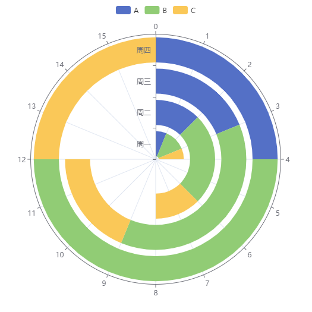
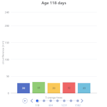
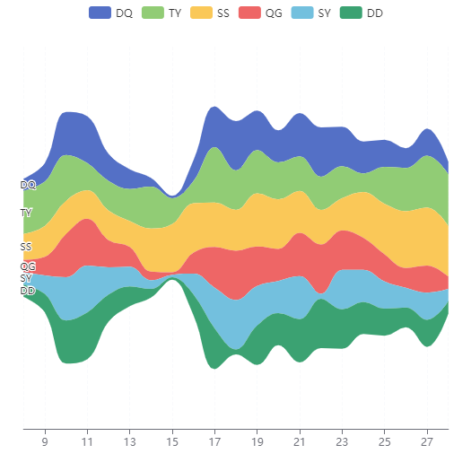
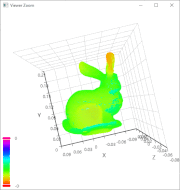
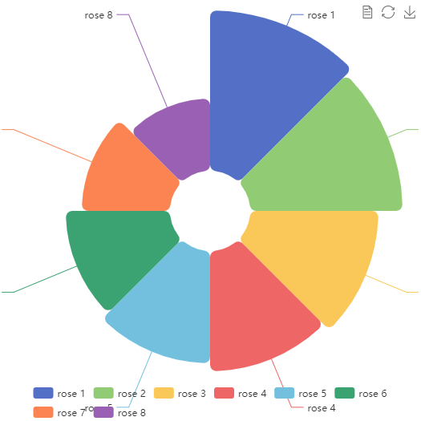
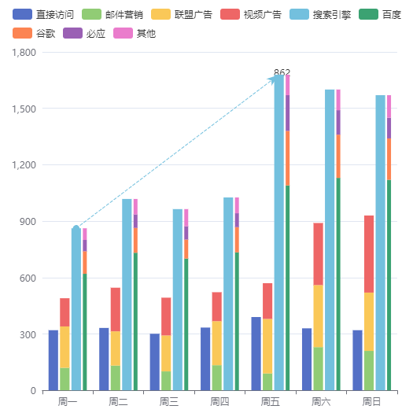

#  echarty

<!-- badges: start -->

[](https://github.com/helgasoft/echarty/actions)
[](https://coveralls.io/r/helgasoft/echarty?branch=main)
[](https://github.com/helgasoft/echarty/releases/)
[](https://helgasoft.github.io/echarty)
[](https://twitter.com/echarty_R)

<!--
[](https://cranlogs.r-pkg.org/badges/last-day/echarty)   -->

<!-- badges: end -->

<a href='https://helgasoft.github.io/echarty'></a>

This package is a thin R wrapper around Javascript library
[ECharts](https://echarts.apache.org/en/index.html).  
**One** major command(_ec.init_) uses R lists to support the [ECharts API](https://echarts.apache.org/en/option.html).  
Benefit from ECharts **full functionality** and build
interactive charts in R and Shiny with minimal overhead.  

Wider connectivity and deployment potential through [WebR](https://helgasoft.github.io/echarty/test/coder.html) and  [crosstalk](https://rpubs.com/echarty/crosstalk).  

<details> <summary><b>Compare to echarts4r</b> 📌</summary>

R package | echarts4r | echarty
--- | --- | ---
initial commit | Mar 12, 2018 | Feb 5, 2021
library size |  | 
test coverage |  [](https://coveralls.io/github/JohnCoene/echarts4r) |  [](https://coveralls.io/github/helgasoft/echarty)
lines of code | 1,202,623 [](https://api.codetabs.com/v1/loc/?github=JohnCoene/echarts4r) | 5,517 [](https://api.codetabs.com/v1/loc?github=helgasoft/echarty)
API design <sup>(1)</sup> | own commands with parameters | mostly [ECharts option](https://echarts.apache.org/en/option.html) lists
number of commands | over [200](https://echarts4r.john-coene.com/reference/) | **one** command + optional utility commands
[dataset](https://echarts.apache.org/en/option.html#dataset) support | no | **yes**
[WebR](https://docs.r-wasm.org/webr/latest/) support | no	| **yes**
[crosstalk](https://rstudio.github.io/crosstalk/) support | no | **yes**
dependencies ([packrat](https://rdrr.io/cran/packrat/src/R/recursive-package-dependencies.R#sym-recursivePackageDependencies)) | 65 | 40 
dependencies ([WebR](https://repo.r-wasm.org)) | 188 | 46 
utilities | bezier, correlations, histogram, density, loess, flip, nesting, more | extended boxplots, tabsets, layouts, shapefiles, lotties, more

<sup>(1)</sup> We encourage users to follow the original ECharts API to construct charts with echarty. 
	This differs from echarts4r which uses own commands for most chart options.   

Comparison review done Feb 2024 for current versions of echarts4R and echarty.
___
</details>

Please consider granting a Github star ⭐ to show your support.  

## Installation

<!-- [](https://github.com/helgasoft/echarty/releases)  <sup>.02</sup>  -->
Latest development build **1.6.5**

``` r
if (!requireNamespace('remotes')) install.packages('remotes')
remotes::install_github('helgasoft/echarty')
```

[](https://cran.r-project.org/package=echarty) 
From [CRAN](https://CRAN.R-project.org):

``` r
install.packages('echarty')
```

## Examples

``` r
library(echarty); library(dplyr)

#  scatter chart (default)
cars |> ec.init()

#  parallel chart
ToothGrowth |> ec.init(ctype= 'parallel')

#  3D chart with GL plugin
iris |> group_by(Species) |> ec.init(load= '3D')

#  timeline of two series with grouping, formatting, autoPlay
iris |> group_by(Species) |> 
ec.init(
  timeline= list(autoPlay= TRUE),
  series.param = list(
    symbolSize= ec.clmn('Petal.Width', scale= 9),
    encode= list(x= 'Sepal.Width', y='Petal.Length'),
    markLine= list(data= list(list(type='max'), list(type='min')))
  )
)

# show a remote map chart, needs package leaflet installed
echarty::ec.fromJson('https://helgasoft.github.io/echarty/test/pfull.json')

```

## Get started

The **Coder** is a good introduction, type ```library(echarty); demo(coder)```.  
The [**WEBSITE**](https://helgasoft.github.io/echarty) has a vast gallery with code and tutorials.  
The package itself has [code examples](https://github.com/helgasoft/echarty/blob/main/demo/examples.R)
included.
Now you can start building [**beautiful ECharts**](https://echarts.apache.org/examples/en/index.html) with R and Shiny!

<br>
<p align="center">
<a href='https://helgasoft.github.io/echarty/articles/gallery.html' target='_blank'>
  
  
  
   <br>
  <!-- img src="man/figures/ssMorph.gif" width="180"/ -->
  
  
  
</a> 
<br>Made with echarty. Powered by ECharts.
</p>
