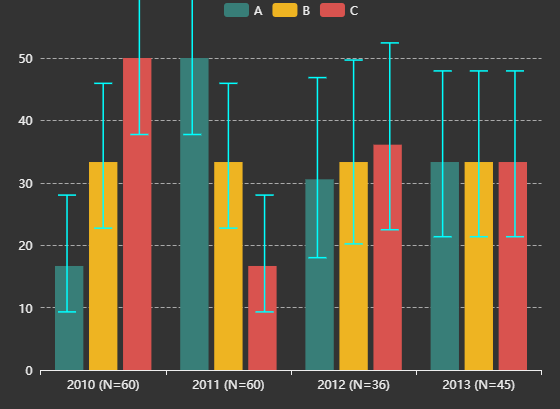

## Code Basket

Gallery of some interesting charts and their code.

<br />
Custom chart <br />

<details><summary>View code</summary>


```r
# source https://echarts.apache.org/examples/en/editor.html?c=custom-profit
# GUI translated with echarty::ec.js2r() with rdata and ritem added

library(echarty); library(dplyr)
data <- list(c(10, 16, 3, "A"), c(16, 18, 15, "B"), c(18, 26, 12, "C"), c(26, 32, 22, "D"), c(32, 56, 7, "E"), c(56, 62, 17, "F"))
colorList <- c("#4f81bd", "#c0504d", "#9bbb59", "#604a7b", "#948a54", "#e46c0b")
rdata <- 1:6 %>% purrr::map(function(x) {
    list(value = data[[x]],
          itemStyle = list(color=colorList[x])) })
ritem <- "function renderItem(params, api) {
    var yValue = api.value(2);
    var start = api.coord([api.value(0), yValue]);
    var size = api.size([api.value(1) - api.value(0), yValue]);
    var style = api.style();

    return {
        type: 'rect',
        shape: {
            x: start[0],
            y: start[1],
            width: size[0],
            height: size[1]
        },
        style: style
    };
}"
p <- ec.init() %>% ec.theme('dark-mushroom')      # only 2 commands used
p$x$opts <- list(
    title = list(text = "Profit", left = "center"),
    tooltip = list(ey = ""),
    xAxis = list(scale = TRUE), yAxis = list(ey = ""),
    series = list(list(type = "custom",
         renderItem = htmlwidgets::JS(ritem),
         label = list(show = TRUE, position = "top"),
         dimensions = list("from", "to", "profit"),
         encode = list(x = list(0, 1), y = 2,
                           tooltip = list(0, 1, 2), itemName = 3),
         data = rdata ))
)
p
```
</details>

<p>&nbsp;</p>
Error Bars <br />

<details><summary>View code</summary>

```r
# example by https://github.com/kuzmenkov111
library(echarty)
library(data.table)
library(binom); library(dplyr)
# function for percent and CI calculation
myfun_binom <- function(n,all){
  round((binom::binom.confint(n, all, methods = "wilson", conf.level=0.95)[,c(4:6)])*100,2)
}
#  --- 1. data prep
stackbar <- data.table(Year = c(2010, 2010, 2010, 2011, 2011, 2011, 2012, 2012, 2012, 2013,2013, 2013),
                       Category = c("A", "B", "C", "A", "B", "C", "A", "B", "C", "A", "B", "C"),
                       n = c(10, 20, 30, 30, 20, 10, 11,12,13, 15, 15, 15))
# calculate percent and 95% CI
stackbar <- stackbar[,`:=`(all=sum(n)), by = c("Year")][,c("perc","low","up") := myfun_binom(n,all)]
stackbar <- stackbar %>% mutate(xlbl=paste0(Year,' (N=',all,')'))
stackbar <- stackbar %>% relocate(xlbl,perc)  # move in front as natural X & Y columns
stackbar <- stackbar %>% group_by(Category)   # both ec.init & ecr.ebars need grouped data
#  --- 2. plot
q <- stackbar %>% ec.init(group1='bar', load='custom') %>%
     ec.theme('dark-mushroom') %>%
     ecr.ebars(stackbar[,c('xlbl','low','up','Category')],    # only columns for x,low,high,category
               hwidth = 9)    # (optional) half-width of err.bar in pixels
#  --- 3. customization
groupColors <- c("#387e78","#eeb422","#d9534f")
q$x$opts$series <- lapply(q$x$opts$series, function(s, i) {
  if (s$type=='bar') {
    s$emphasis <- list(focus = 'series')
    s$color <- groupColors[parent.frame()$i[]]  # iteration hack, for fun only
  }
  else if (s$type=='custom')
    s$color <- 'cyan'
  s
})
q   # customized
```
</details>


<p>&nbsp;</p>
Crosstalk in 3D <br />


<details><summary>View code</summary>


```r
# echarty can highlight 3D points selected by external controls
library(crosstalk); library(DT); library(htmltools)
library(echarty.c); library(dplyr); library(tibble)
sdf <- mtcars %>% rownames_to_column(var='name') %>% relocate(mpg,wt) 
sdf <- SharedData$new(sdf)

p3 <- sdf %>% echarty.c::ec.init(load='3D', 
            title = list(text="3D/GL brush listener")) %>%
            ec.theme('dark-mushroom')
p3$x$opts$series[[1]] <- list(
  type='scatter3D', symbolSize=11,
  encode=list(x='mpg', y='wt', z='hp'),
  itemStyle=list(color = htmlwidgets::JS("function(params){
    let cyl=params.value[3]; return (cyl==4 ? 'RoyalBlue' : cyl==6 ? 'OrangeRed':'green');}") ),
  emphasis = list(focus='self', blurScope='series', itemStyle=list(color='red')),
  blur = list(opacity = 0.2)
)
p3$x$opts$xAxis3D <- list(name='mpg')
p3$x$opts$yAxis3D <- list(name='wt')
p3$x$opts$zAxis3D <- list(name='hp')

bscols( list(
    d3scatter(sdf, ~mpg, ~wt, ~factor(cyl), width="100%", height=300),br(),
    datatable(sdf, extensions="Scroller", style="bootstrap", class="compact", width="100%",
              options=list(deferRender=TRUE, scrollY=300, scroller=TRUE))
  ),  p3
)
```
</details>

<p>&nbsp;</p>
Gauge triple
<details><summary>View code</summary>

```r
jcode <- "setInterval(function () {
    opts.series[0].data[0].value = (Math.random() * 100).toFixed(2) - 0;
    opts.series[0].data[1].value = (Math.random() * 100).toFixed(2) - 0;
    opts.series[0].data[2].value = (Math.random() * 100).toFixed(2) - 0;
    chart.setOption(opts, true);
}, 2000);"
library(echarty)
p <- ec.init(js=jcode)
p$x$opts <- list(series = list(list(type = "gauge", anchor = list(show = TRUE, showAbove = TRUE,
  size = 18, itemStyle = list(color = "#FAC858")), pointer = list(icon = "path://M2.9,0.7L2.9,0.7c1.4,0,2.6,1.2,2.6,2.6v115c0,1.4-1.2,2.6-2.6,2.6l0,0c-1.4,0-2.6-1.2-2.6-2.6V3.3C0.3,1.9,1.4,0.7,2.9,0.7z",
  width = 8, length = "80%", offsetCenter = list(0, "8%")), progress = list(show = TRUE,
  overlap = TRUE, roundCap = TRUE), axisLine = list(roundCap = TRUE), data = list(list(value = 20,
  name = "完成率", title = list(offsetCenter = list("-40%", "80%")), detail = list(offsetCenter = list("-40%",
    "95%"))), list(value = 40, name = "达标率", title = list(offsetCenter = list("0%",
  "80%")), detail = list(offsetCenter = list("0%", "95%"))), list(value = 60, name = "优秀率",
  title = list(offsetCenter = list("40%", "80%")), detail = list(offsetCenter = list("40%",
    "95%")))), title = list(fontSize = 14), detail = list(width = 40, height = 14, fontSize = 14,
  color = "#fff", backgroundColor = "auto", borderRadius = 3, formatter = "{value}%"))))
p
```
</details>