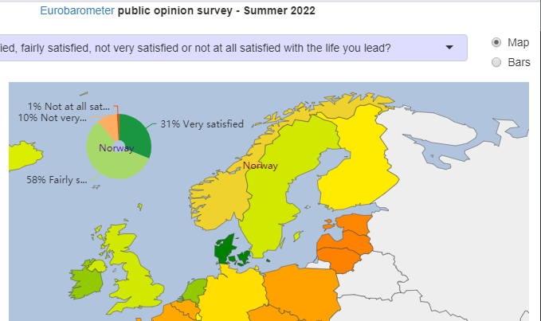

# echarty extras 💲

Utilities and small applications built with open-source library _echarty_. They accomplish very specific and uncommon tasks.
Considerable amount of time was spent in design, development and testing of these modules.  
 
They are fairly priced at **$30 each** and payable through [**Paypal**](https://www.paypal.com/paypalme/helgasoft).  
Please include module description when ordering under "_What is this payment for ?_". Delivery and support by email. Future versions could be sent on demand.  

  The entire (all as a) bundle for $200.  
(not?) included in the price and code will be sent on demand.  
(external, enhancements, based on, ,  (not part of) favorably)
These utilities were developed ...with the intent of ( and destined to)    to help clients solve/achieve very specific and uncommon tasks/results.
A knowledgable soft eng could..   singular 

 

## Violin chart  
   
Violin charts are similar to boxplot, but show the full distribution of the data. Supports single or grouped datasets. Rich customization including jittered data points and mean.  

🔻 Parameters
  

- <strong>df</strong> data.frame with X,Y values (required)
- <strong>cvalue</strong> name of values column (required)
- <strong>cname</strong> optional name of names(categories) column
- <strong>vertical</strong> boolean for vertical(default) or horizontal layout
- <strong>lineWidth</strong> width of the contour line, default 3
- <strong>wcoeff</strong> width coefficient for each violin, default is 0.45
- <strong>jitter</strong> value (>=0) of parameter _amount_ in jitter, default NULL(no jittered points)
- <strong>j.*</strong> optional jitter points parameters like j.symbolSize
- <strong>d.*</strong> optional density parameters like d.adjust,d.cut,etc. d.n default is 64
- <strong>m.*</strong> optional mean point parameters like m.symbol,m.symbolSize,etc. If missing, mean is not shown.
- <strong>...</strong> optional attributes for the violin contour series
- <strong>returns</strong> a named list of xAxis, yAxis and series. Series are: _custom_ for violin, optional _scatter_ for jitter and mean.

  
 

<video id="vidshp" preload="auto" 
   src="img/violin.mp4" type="video/mp4" muted="muted" controls>
   Your browser does not support the video tag.
</video>

 

## Keyboard Input Support
 

Enter keyboard mode with _click_, exit with _Tab_  
Keys with functions implemented, many more possible:  
- arrowLeft, arrowRight = highlight data points to left and right
- pageUp, pageDown = switch series
- +, - =  zoom chart in and out

<video id="keys" preload="auto" 
   src="img/keys.mp4" type="video/mp4" muted="muted" controls>
   Your browser does not support the video tag.
</video>
 
 

## 3D regression planes
 

The familiar _quakes_ R dataset is visualized in 3D environment (lat,long,depth) over an area map with tectonic plate boundaries. 
User can show/hide 3D regression planes(s) built from selected 3D points.  
 
<video id="3dreg" preload="auto" 
   src="img/quake.mp4" type="video/mp4" muted="muted" controls>
   Your browser does not support the video tag.
</video>

See also 3D regression planes in [iris dataset](img/iris3d.mp4).
 
 
## Morphing drilldown
 

The _mtcars_ R dataset presented with morphing drilldown. There are two levels of data:
- top level is an aggregate, like counts by type, or average by type
- lower level are the actual data rows

Morphing is achieved between two top levels, and between top and lower levels.  
 
<video id="morph" preload="auto" 
   src="img/morph.cars.mp4" type="video/mp4" muted="muted" controls>
   Your browser does not support the video tag.
</video>
 
 

## Eurobarometer Survey
 

🗺️ Eurobarometer public opinion [survey Summer 2022](https://europa.eu/eurobarometer/surveys/detail/2693).  
180 questions with multiple answers mapped by country, 26K participants from 27 countries.
An interactive R/Shiny/echarty app.  
[**Live Demo**](https://helgalabs.shinyapps.io/eurobarometer)

  

## Ternary Plots
 

Interactive - data groups with show/hide, zoom, click, customizable tooltips.  

🔻 3D rotation allows checking for data consistency
  

The plot depicts the ratios of the three variables as positions in an equilateral triangle. In the example, the three values are sector percentages of a country's GDP. Their sum should be 100%, but some data may be inaccurate. So by rotating the chart in 3D we could easily find those incomplete data points, for example Belize: 9.7% +13.8% +62.2% = 85.7%

  

Demo [example data](https://gist.githubusercontent.com/toja/811f0ddc765c59c26de544fd0e0ba46f/raw/eef11e930f6c05700faca47711b173f795a84181/sectors.csv) is for world countries GDP by economic sectors.
 
<video id="ternary" preload="auto" 
   src="img/ternary.mp4" type="video/mp4" muted="muted" controls>
   Your browser does not support the video tag.
</video>
  

<!--
## Panoramas and maps  

Leaflet map with POI markers. Clicking on a marker switches to an interactive custom 360° panorama of the location. Each pano could also have POI as clickable hyperlinks inside.  
video  ech.tmp.R
-->

