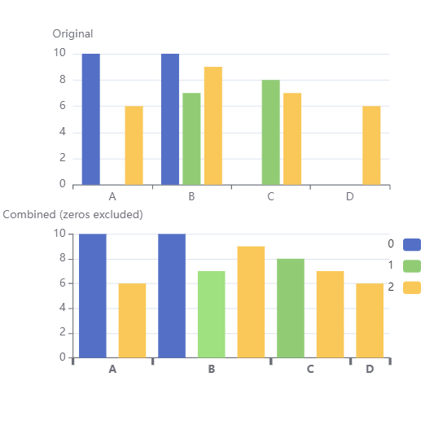

# echarty extras 💲

Utilities and small applications built with open-source library _echarty_. They accomplish very specific and uncommon tasks.
Considerable amount of time was spent in design, development and testing of these modules.  
<br>
They are fairly priced at **$30 each** and payable through [**Paypal**](https://www.paypal.com/paypalme/helgasoft).  
Please include module description when ordering under "_What is this payment for ?_". Delivery and support by email. Future versions could be sent on demand. For questions please [contact us](mailto:contact@helgasoft.com?subject=echarty.extras).

<div style="display:none;"> 
https://helgasoft.com/#contact-section
</div>

## Violin chart  
 
Violin charts are similar to boxplot, but show the full distribution of the data. Supports single or grouped datasets. Rich customization including jittered data points and mean.  
<details><summary>🔻 Parameters</summary>  

- <strong>df</strong> data.frame with X,Y values (required)
- <strong>cvalue</strong> name of values column (required)
- <strong>cname</strong> optional name of names(categories) column
- <strong>vertical</strong> boolean for vertical(default) or horizontal layout
- <strong>lineWidth</strong> width of the contour line, default 3
- <strong>wcoeff</strong> width coefficient for each violin, default is 0.45
- <strong>jitter</strong> value (>=0) of parameter _amount_ in jitter, default NULL(no jittered points)
- <strong>j.*</strong> optional jitter points parameters like j.symbolSize
- <strong>d.*</strong> optional density parameters like d.adjust,d.cut,etc. d.n default is 64
- <strong>m.*</strong> optional mean point parameters like m.symbol,m.symbolSize,etc. If missing, mean is not shown.
- <strong>...</strong> optional attributes for the violin contour series
- <strong>returns</strong> a named list of xAxis, yAxis and series. Series are: _custom_ for violin, optional _scatter_ for jitter and mean.
</details>  
<br />

<video id="vidshp" preload="auto" 
   src="img/violin.mp4" type="video/mp4" muted="muted" controls>
   Your browser does not support the video tag.
</video>
<br /><br />

## Keyboard Input Support

Enter keyboard mode with _click_, exit with _Tab_  
Keys with functions implemented, many more possible:  
- arrowLeft, arrowRight = highlight data points to left and right
- pageUp, pageDown = switch series
- +, - =  zoom chart in and out

<video id="keys" preload="auto" 
   src="img/keys.mp4" type="video/mp4" muted="muted" controls>
   Your browser does not support the video tag.
</video>
<br /><br />

## 3D regression planes

The familiar _quakes_ R dataset is visualized in 3D environment (lat,long,depth) over an area map with tectonic plate boundaries. 
User can show/hide 3D regression planes(s) built from selected 3D points.  
<br />
<video id="3dreg" preload="auto" 
   src="img/quake.mp4" type="video/mp4" muted="muted" controls>
   Your browser does not support the video tag.
</video>

See also 3D regression planes in [iris dataset](img/iris3d.mp4).
<br /><br />

## Morphing drilldown

The _mtcars_ R dataset presented with morphing drilldown. There are two levels of data:
- top level is an aggregate, like counts by type, or average by type
- lower level are the actual data rows

Morphing is achieved between two top levels, and between top and lower levels.  
<br />
<video id="morph" preload="auto" 
   src="img/morph.cars.mp4" type="video/mp4" muted="muted" controls>
   Your browser does not support the video tag.
</video>
<br />
<br />

## Eurobarometer Survey

🗺️ Eurobarometer public opinion [survey Summer 2022](https://europa.eu/eurobarometer/surveys/detail/2693).  
180 questions with multiple answers mapped by country, 26K participants from 27 countries.
An interactive R/Shiny/echarty app.  
[**Live Demo**](https://helgalabs.shinyapps.io/eurobarometer)
<a href='https://helgalabs.shinyapps.io/eurobarometer' target=_blank> </a>
<br><br>

<a id='ternary'></a>

## Ternary Plots

Interactive - data groups with show/hide, zoom, click, customizable tooltips.  
<details><summary>🔻 3D rotation allows checking for data consistency</summary>  

The plot depicts the ratios of the three variables as positions in an equilateral triangle. In the example, the three values are sector percentages of a country's GDP. Their sum should be 100%, but some data may be inaccurate. So by rotating the chart in 3D we could easily find those incomplete data points, for example Belize: 9.7% +13.8% +62.2% = 85.7%
</details>  

Demo [example data](https://gist.githubusercontent.com/toja/811f0ddc765c59c26de544fd0e0ba46f/raw/eef11e930f6c05700faca47711b173f795a84181/sectors.csv) is for world countries GDP by economic sectors.
<br /><br />
<video id="ternary" preload="auto" 
   src="img/ternary.mp4" type="video/mp4" muted="muted" controls>
   Your browser does not support the video tag.
</video>
<br/><br/>

<a id='quadrant'></a>

## Quadrant chart

Offers the following options:

- cutomizable axes with or without labels
- points with constant or variable size
- automatic coloring of points and/or point labels by quadrant
- interactivity: tooltip, drag and drop points across the chart
- toolbox button to save chart as PNG
- responsive auto-resize

Only <span style="color:black; background:orange">&nbsp;Javascript&nbsp;</span> version currently available.

<br /> 
<video id="quadrant" preload="auto" 
   src="img/quadrant.mp4" type="video/mp4" muted="muted" controls>
   Your browser does not support the video tag.
</video>
<br />

<a id='trimZero'></a>

## Compressed bars

Sparse datasets could show exessive **empty spaces** in a bar chart. Problem is solved by compressing bars with a non-linear axis. Custom function _trimZero_ will transform the initial dataset and prepare the non-linear axis for display. Below is a comparison sample.
<details><summary>🔻 View simulated code</summary> 

```r
tmp <- "
A, B, C,D
10,10,0,0
0, 7, 8,0
6, 9, 7,6"
df <- read.csv(text=tmp, header=T)

tz <- trimZero(df)
ec.init(
  dataset= tz$dataset, 
  xAxis= tz$xAxis,
  series= list(list(type= 'bar', encode= list(x= 'x', y= 'value') )),
  visualMap= list(
    type= 'piecewise', top= 10, right= 10,
    categories= tz$vmCat,
    inRange= list(color= c('blue','green','gold'))
  )
)
```
</details>  


<a id='axisGroups'></a>

## Axis category groups

Helper function to build a two-level axis, with responsive auto-resize.  
Only <span style="color:black; background:orange">&nbsp;Javascript&nbsp;</span> version currently available, but could be used with _ec.init_.
<details><summary>🔻 View JS simulated code</summary> 

```js
function grax(dd, vv, ll, gg){...}
dset = [
  ['value', 'name', 'group', 'col'],
  [5, 'apple','fruits','red'],
  [20,'orange','fruits','blue'],
  [36,'kiwi','fruits','red'],
  [28,'carrot','vegetables','green'],
  [22,'lettuce','vegetables',], 
  [20,'cabbage','vegetables',],
  [18,'celery','vegetables',null]
];
out = grax(dset, 'value', 'name', 'group')

out.series.find(o => o.type==='bar').itemStyle = {
  color: (v) => { gr= v.value[2]; return gr=='fruits' ? '#482878' : '#1F9E89'; }
}

option = {
  dataset: out.dset, 
  series: out.series,
  xAxis: out.axis,
  yAxis: { name: 'val' },
  tooltip: { formatter: (p) => {return 'y=' + p.data[0]; } }
};
```
</details>

<br /> 
<video id="axgrp" preload="auto" 
   src="img/barGroups.mp4" type="video/mp4" muted="muted" controls>
   Your browser does not support the video tag.
</video>
<br />

<!--
## Panoramas and maps  

Leaflet map with POI markers. Clicking on a marker switches to an interactive custom 360° panorama of the location. Each pano could also have POI as clickable hyperlinks inside.  
video  ech.tmp.R
-->

