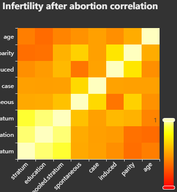
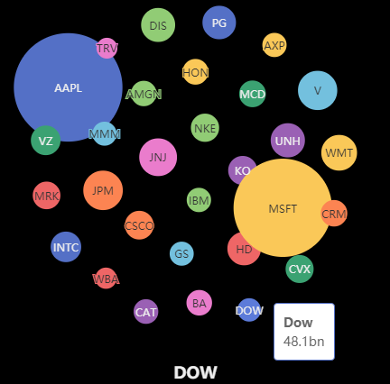
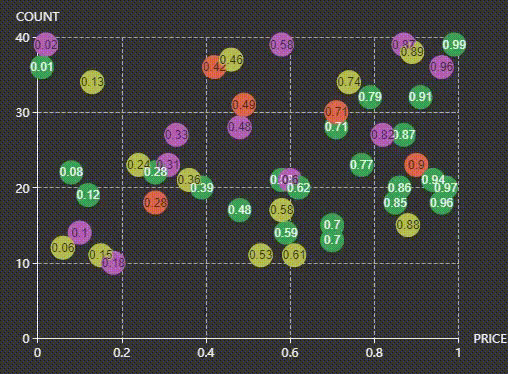

## Gallery

 Some interesting charts along with their **code**. Several have Live Demos hosted on [RPubs](https://rpubs.com/echarty). The *echarty* package has two dozen more examples - in RStudio type *?ec.examples* to see them in panel Help.


### Simple bar  
demo for presets  

<details><summary>🔻View code</summary>

```r
library(echarty); library(dplyr)
library(lubridate)
df <- data.frame(date=as.character(as.Date('2019-12-31') %m+% months(1:13)), 
                 num=runif(13))

#  with presets and df chained
p <- df %>% ec.init(group1='bar') %>% ec.theme('dark')
p$x$opts$xAxis <- list(type = 'category')
p

#  without presets all options are explicitly assigned
p <- ec.init(preset=FALSE) %>% ec.theme('dark')
p$x$opts <- list(
  yAxis = list(ii=''),   # 'ii' is a dummy attribute to set default axis
  xAxis = list(type = 'category', 
               axisLabel = list(interval=0, rotate=45)
               #, axisTick=list(alignWithLabel=TRUE)
          ),
  series = list(list(
    type='bar', data=ec.data(df, 'values', FALSE)))
)
p

```
</details>
<br />  

### Data models 
how to store data in echarty - 
[<span style="color:magenta">Live Demo</span>](https://rpubs.com/echarty/data-models) with code  
<a href='https://rpubs.com/echarty/data-models' target=_blank> </a>
<br><br>

### Horizontal bars

<details><summary>🔻 View code</summary>

```r
library(echarty); library(dplyr)
df <- Orange %>% mutate(Tree=as.character(Tree)) %>%
      arrange(Tree) %>% group_by(Tree) %>% group_split()

p <- ec.init(preset=FALSE) %>% ec.theme('dark')
p$x$opts <- list(
  series = lapply(df, function(t) {
    list(type='bar', name=unique(t$Tree), data=t$circumference) }),
  legend = list(ii=''),
  xAxis = list(name='tree circumference in mm', nameLocation='center', nameGap=22),
  yAxis = list(data=unique(Orange$age), name='age in days'),
  tooltip = list(formatter='circumference={c} mm')
)
l <- length(p$x$opts$series)
p$x$opts$series[[l]]$name <- paste(p$x$opts$series[[l]]$name, ' trees')
p
```
</details>
<br />

### Easy as pie

<details><summary>🔻 View code</summary>

```r
isl <- data.frame(name=names(islands), value=islands) %>% filter(value>60) %>% arrange(value)

library(echarty)
p <- ec.init()
p$x$opts <- list(
  title = list(text = "Landmasses over 60,000 mi\u00B2", left = 'center'),
  tooltip = list(trigger='item'),
  series = list(type='pie', data=ec.data(isl, 'names')),
  backgroundColor = '#191919')
p
```
</details>
<br />

### Parallel chart

<details><summary>🔻 View code</summary>

```r
p <- iris %>% group_by(Species) %>% 
  ec.init(group1='parallel') %>% ec.theme('dark-mushroom')
p$x$opts$series <- lapply(p$x$opts$series, function(x) { 
  x$smooth=TRUE; x$lineStyle=list(width=3); x })  # update preset series
p$x$opts$color <- rainbow(10)
p
# note: parallel presets are coming after v.0.3.2
```
</details>
<br />

### Custom chart

<details><summary>🔻 View code</summary>

```r
# source https://echarts.apache.org/examples/en/editor.html?c=custom-profit
# GUI translated with demo(js2r) with rdata and ritem added

library(echarty); library(dplyr)
data <- list(c(10, 16, 3, "A"), c(16, 18, 15, "B"), c(18, 26, 12, "C"), c(26, 32, 22, "D"), c(32, 56, 7, "E"), c(56, 62, 17, "F"))
colorList <- c("#4f81bd", "#c0504d", "#9bbb59", "#604a7b", "#948a54", "#e46c0b")
rdata <- 1:6 %>% purrr::map(function(x) {
    list(value = data[[x]],
          itemStyle = list(color=colorList[x])) })
ritem <- "function renderItem(params, api) {
    var yValue = api.value(2);
    var start = api.coord([api.value(0), yValue]);
    var size = api.size([api.value(1) - api.value(0), yValue]);
    var style = api.style();

    return {
        type: 'rect',
        shape: {
            x: start[0],
            y: start[1],
            width: size[0],
            height: size[1]
        },
        style: style
    };
}"
p <- ec.init() %>% ec.theme('dark-mushroom')      # only 2 commands used
p$x$opts <- list(
    title = list(text = "Profit", left = "center"),
    tooltip = list(ey = ""),
    xAxis = list(scale = TRUE), yAxis = list(ey = ""),
    series = list(list(type = "custom",
         renderItem = htmlwidgets::JS(ritem),
         label = list(show = TRUE, position = "top"),
         dimensions = list("from", "to", "profit"),
         encode = list(x = list(0, 1), y = 2,
                           tooltip = list(0, 1, 2), itemName = 3),
         data = rdata ))
)
p
```
</details>
<br />

### Error Bars

<details><summary>🔻 View code</summary>

```r
# example by https://github.com/kuzmenkov111
library(echarty)
library(data.table)
library(binom); library(dplyr)
# function for percent and CI calculation
myfun_binom <- function(n,all){
  round((binom::binom.confint(n, all, methods = "wilson", conf.level=0.95)[,c(4:6)])*100,2)
}
#  --- 1. data prep
stackbar <- data.table(Year = c(2010, 2010, 2010, 2011, 2011, 2011, 2012, 2012, 2012, 2013,2013, 2013),
                       Category = c("A", "B", "C", "A", "B", "C", "A", "B", "C", "A", "B", "C"),
                       n = c(10, 20, 30, 30, 20, 10, 11,12,13, 15, 15, 15))
# calculate percent and 95% CI
stackbar <- stackbar[,`:=`(all=sum(n)), by = c("Year")][,c("perc","low","up") := myfun_binom(n,all)]
stackbar <- stackbar %>% mutate(xlbl=paste0(Year,' (N=',all,')'))
stackbar <- stackbar %>% relocate(xlbl,perc)  # move in front as natural X & Y columns
stackbar <- stackbar %>% group_by(Category)   # both ec.init & ecr.ebars need grouped data
#  --- 2. plot
q <- stackbar %>% ec.init(group1='bar', load='custom') %>%
     ec.theme('dark-mushroom') %>%
     ecr.ebars(stackbar[,c('xlbl','low','up','Category')],    # only columns for x,low,high,category
               hwidth = 9)    # (optional) half-width of err.bar in pixels
#  --- 3. customization
groupColors <- c("#387e78","#eeb422","#d9534f")
q$x$opts$series <- lapply(q$x$opts$series, function(s, i) {
  if (s$type=='bar') {
    s$emphasis <- list(focus = 'series')
    s$color <- groupColors[parent.frame()$i[]]  # iteration hack, for fun only
  }
  else if (s$type=='custom')
    s$color <- 'cyan'
  s
})
q   # customized
```
</details>
<br />

### Triple gauge with animation

<details><summary>🔻 View code</summary>

```r
jcode <- "setInterval(function () {
    opts.series[0].data[0].value = (Math.random() * 100).toFixed(2) - 0;
    opts.series[0].data[1].value = (Math.random() * 100).toFixed(2) - 0;
    opts.series[0].data[2].value = (Math.random() * 100).toFixed(2) - 0;
    chart.setOption(opts, true);
}, 2000);"
library(echarty)
p <- ec.init(js=jcode) %>% ec.theme('dark')
p$x$opts <- list(series = list(
    list(type = "gauge", 
    anchor = list(show = TRUE, showAbove = TRUE,
    size = 18, itemStyle = list(color = "#FAC858")), 
    pointer = list(icon = "path://M2.9,0.7L2.9,0.7c1.4,0,2.6,1.2,2.6,2.6v115c0,1.4-1.2,2.6-2.6,2.6l0,0c-1.4,0-2.6-1.2-2.6-2.6V3.3C0.3,1.9,1.4,0.7,2.9,0.7z",
    width = 8, length = "80%", offsetCenter = list(0, "8%")), 
    progress = list(show = TRUE,
      overlap = TRUE, roundCap = TRUE), axisLine = list(roundCap = TRUE), 
    data = list(
      list(value = 20, name = "One", title = list(offsetCenter = list("-40%", "80%")), detail = list(offsetCenter = list("-40%","95%"))), 
      list(value = 40, name = "Two", title = list(offsetCenter = list("0%", "80%")), detail = list(offsetCenter = list("0%", "95%"))), 
      list(value = 60, name = "Three", title = list(offsetCenter = list("40%", "80%")), detail = list(offsetCenter = list("40%","95%")))), 
    title = list(fontSize = 14), detail = list(width = 40, height = 14, fontSize = 14, color = "#fff", backgroundColor = "auto", borderRadius = 3, formatter = "{value}%"))))
p
```
</details>
<br />
<a id='3D'></a>

### Crosstalk in 3D


<details><summary>🔻 View code</summary>

```r
# echarty can highlight 3D points selected by external controls
library(crosstalk); library(DT); library(d3scatter); library(htmltools)
library(echarty); library(dplyr); library(tibble)
sdf <- mtcars %>% rownames_to_column(var='name') %>% relocate(mpg,wt) 
sdf <- SharedData$new(sdf)

p3 <- sdf %>% ec.init(load='3D', 
            title = list(text="3D brush listener")) %>%
            ec.theme('dark-mushroom')
p3$x$opts$series[[1]] <- list(
  type='scatter3D', symbolSize=11,
  encode=list(x='mpg', y='wt', z='hp'),
  itemStyle=list(color = htmlwidgets::JS("function(params){
    let cyl=params.value[3]; return (cyl==4 ? 'RoyalBlue' : cyl==6 ? 'OrangeRed':'green');}") ),
  emphasis = list(focus='self', blurScope='series', itemStyle=list(color='red')),
  blur = list(opacity = 0.2)
)
p3$x$opts$xAxis3D <- list(name='mpg')
p3$x$opts$yAxis3D <- list(name='wt')
p3$x$opts$zAxis3D <- list(name='hp')

bscols( list(
    d3scatter(sdf, ~mpg, ~wt, ~factor(cyl), width="100%", height=300),br(),
    datatable(sdf, extensions="Scroller", style="bootstrap", class="compact", width="100%",
              options=list(deferRender=TRUE, scrollY=300, scroller=TRUE))
  ),  p3
)
```
</details>
<br />

### Crosstalk 2D
play with the [<span style="color:magenta">Live Demo</span>](https://rpubs.com/echarty/crosstalk)  
<br />


### scatterGL
plugin **3D**, test with 5,000 points  

<details><summary>🔻 View code</summary>

```r
# example works also with type='scatter', just ec.data needs to be format='values'
library(echarty); library(tibble)
dim <- 2500   # sample data half-quantity, could be 100x more
slip <- if (dim %% 2) 0.1 else -0.1
setData <- function(offset) {
	t <- tibble(x = runif(dim, max=10),
					y = offset + sin(x) - x * slip * runif(dim))
	round(t,3)
}
sers <- NULL	# two consecutive series, same data shifted vertically
for(i in 0:1) 
	sers <- append(sers, list(
	list(type = 'scatterGL',
		data = ec.data(setData(i), 'dataset', FALSE),
		symbolSize=3, large=TRUE,
		itemStyle=list(opacity=0.4, color=(if (i==0) 'cyan' else 'pink'))
	)
	))
p <- ec.init(load='3D', preset=FALSE)  %>% ec.theme('dark-mushroom') 
p$x$opts <- list(
  xAxis = list(ey=''),	  # scatterGL is not 3D, needs 2D axes
  yAxis = list(ey=''),
  series = sers,
  dataZoom = list(type='inside',start=50)
)
p
```
</details>
<br />

### scatter3D
plugin **3D**, test with 36,000 points  

<details><summary>🔻 View code</summary>

```r
library(onion); library(echarty)
data(bunny)
tmp <- as.data.frame(bunny)
p <- tmp %>% ec.init(load='3D') %>% ec.theme('dark-mushroom')
p$x$opts$series[[1]] <- list(type='scatter3D', symbolSize=2)
p$x$opts$visualMap <- list( 
      inRange=list(color = rainbow(10)), calculable=TRUE,
      min=min(tmp$y), max=max(tmp$y), dimension=1)
p
```
</details>
<br />

### Bathymetry in 3D
up to 100,000 surface points  

<details><summary>🔻 Shiny app - <span style="color:magenta">Live Demo</span></summary>

```r
shiny::runGist('https://gist.github.com/helgasoft/121d7d3ff7d292990c3e05cfc1cbf24b')
```
</details>
<br />


### Radar chart customized

<details><summary>🔻 View code</summary>

```r
data <- data.frame(
  name = c('129511','129519','129525','129520','129138'),
  values = c(12,45,23,50,32), max = rep(60, 5)
)
# build a list for rich formatting
rifo <- lapply(data$name, function(x) { 
  list(height = 30, 
       backgroundColor=list(
  image=paste0('https://image.flaticon.com/icons/png/512/129/',x,'.png')))
}) 
names(rifo) <- data$name

p <- data %>% ec.init(preset=FALSE) %>% ec.theme('dark-mushroom')
p$x$opts$radar <- list(
  indicator = ec.data(data, 'names'),
  name = list(formatter=htmlwidgets::JS("function(value){ return '{'+value+'| }'; }"),
              rich = rifo)
)
p$x$opts$series = list( list(
  type = 'radar',
  data = list(data$values)
))
p
```
</details>
<br />

### Grouped boxplot
boxplot calculations in R or ECharts

<details><summary>🔻 View code</summary>

```r
library(echarty); library(dplyr)

# 1) boxplot calculation in R ---------------------

p <- ec.init()
p$x$opts$series <- list(
	list(type='boxplot', name='mpg', data=list(boxplot.stats(mtcars$mpg)$stats)), 
	list(type='boxplot', name='hp',  data=list(boxplot.stats(mtcars$hp)$stats)), 
	list(type='boxplot', name='disp',data=list(boxplot.stats(mtcars$disp)$stats))
)	
p$x$opts$xAxis <- list(type = 'category')
p$x$opts$legend <- list(ii='')
p

# 2) boxplot calculation in ECharts ---------------------
#    source: https://echarts.apache.org/examples/en/editor.html?c=boxplot-multi

grps <- list()     # data is 3 groups of 18 experiments
for (grp in 1:3) {
	seriesData <- list()
	for (i in 1:18) {
		cate <- runif(10, 1, 200)
		seriesData <- append(seriesData, list(cate))
	}
	grps[[grp]] <- seriesData
}

p <- ec.init() %>% ec.theme('bm', code='{
      "color":["chartreuse","red","cyan"], 
      "grid":{"backgroundColor":"#333"}, 
      "backgroundColor":"#333", 
      "legend":{"textStyle": {"color": "#eeeeee"}} }')
p$x$opts$dataset <- list(
  list(source=grps[[1]]), list(source=grps[[2]]), list(source=grps[[3]]),
	list(fromDatasetIndex=0, transform=list(type='boxplot', config=list(itemNameFormatter='expr {value}'))),
	list(fromDatasetIndex=1, transform=list(type='boxplot', config=list(itemNameFormatter='expr {value}'))),
	list(fromDatasetIndex=2, transform=list(type='boxplot', config=list(itemNameFormatter='expr {value}')))
)
p$x$opts$series[[1]] <- list(type = 'boxplot', datasetIndex=3, name='c1')
p$x$opts$series[[2]] <- list(type = 'boxplot', datasetIndex=4, name='c2')
p$x$opts$series[[3]] <- list(type = 'boxplot', datasetIndex=5, name='c3')
p$x$opts$xAxis <- list(type = 'category', axisLine=list(onZero=FALSE),
  splitArea = list(show=TRUE))
p$x$opts$legend <- list(ii='')
p$x$opts$tooltip <- list(trigger='item')
p$x$opts$dataZoom <- list(list(type='slider',start=50))
p
```
</details>
<br />

### Correlation matrix
using heatmap chart  

<details><summary>🔻 View code</summary>

```r
library(echarty); library(dplyr)
# prepare and calculate data
mtx <- cor(infert %>% dplyr::mutate(education=as.numeric(education)))
order <- corrplot::corrmatOrder(mtx)
mtx <- mtx[order, order]
df <- as.data.frame(as.table(mtx))
for(i in 1:2) df[,i] <- as.character(df[,i])

p <- ec.init(preset=FALSE) %>% ec.theme('dark')
p$x$opts <- list( 
  title = list(text='Correlation - infertility after abortion'),
  xAxis = list(type='category', data=unique(colnames(mtx)), axisLabel=list(rotate=45)),
  yAxis = list(type='category', data=unique(colnames(mtx))),
  series = list(list(type = 'heatmap', data= ec.data(df,'values') )),
  visualMap = list(min=-1, max=1, calculable=TRUE, orient='vertical',left='right'
    ,inRange=list( color=c('#313695', '#4575b4', '#74add1', '#abd9e9', '#e0f3f8', '#ffffbf', '#fee090', '#fdae61', '#f46d43', '#d73027', '#a50026')) )
)
p
```
</details>
<br />

### Histogram
using bar chart  

<details><summary>🔻 View code</summary>

```r
library(echarty); library(dplyr)
do.histogram <- function(x, breaks='Sturges') {
  # get histogram data from input 'x'
  histo <- hist(x, plot=FALSE, breaks)
  tmp <- data.frame(x=histo$mids, y=histo$counts)
  tmp
}
p <- do.histogram(rnorm(44)) %>% ec.init(group1='bar') %>% ec.theme('dark')
p

# with normal distribution line added
hh <- do.histogram(rnorm(44))
p <- hh %>% ec.init(group1='bar') %>% ec.theme('dark')
nrm <- dnorm(hh$x, mean=mean(hh$x), sd=sd(hh$x))  # normal distribution
p$x$opts$xAxis <- list(list(ii=''), list(data=c(1:length(nrm))))
p$x$opts$yAxis <- list(list(ii=''), list(ii=''))
p$x$opts$series <- append(p$x$opts$series, 
  list(list(type='line', data=nrm, xAxisIndex=1, yAxisIndex=1, color='yellow')))
p

# same with timeline
hh <- data.frame()
for(i in 1:5) {
  tmp <- do.histogram(rnorm(44)) %>% mutate(time=rep(i,n()))
  hh <- rbind(hh, tmp)
}
p <- hh %>% group_by(time) %>% 
  ec.init(tl.series=list(type='bar', encode=list(x='x',y='y'))) %>% 
  ec.theme('dark')
p
```
</details>
<br />


### Modularity plugin
DOW companies - size by market cap<br />

<details><summary>🔻 View code</summary>

```r
# click and drag items to see auto-rearrange effect
library(echarty); library(dplyr)
tmp <- jsonlite::fromJSON('https://quote.cnbc.com/quote-html-webservice/quote.htm?noform=1&partnerId=2&fund=1&exthrs=0&output=json&symbolType=issue&symbols=55991|44503|36276|56858|70258|1607179|84090|142105|145043|148633|151846|167459|174239|178782|174614|197606|202757|205141|205778|212856|228324|260531|277095|81364|283359|10808544|283581|286571|89999|522511530&requestMethod=extended')
df <- tmp$ExtendedQuoteResult$ExtendedQuote$QuickQuote
wt <- data.frame(tic=df$symbol, name=df$altName, bn=NA, size=NA, 
      mcap = df$FundamentalData$mktcapView, 
      rev = df$FundamentalData$revenuettm)
wt$bn <- round(as.numeric(gsub('M','',wt$mcap, fixed=TRUE))/1000,1) # mkt.cap
bnMax <- max(wt$bn)
wt$size <- 30 + wt$bn/bnMax * 140   # size 30 to 140 px depending on mkt.cap
  
p <- ec.init(load='gmodular'); 
p$x$opts <- list(
  title=list(text='DOW 2021',x='center',y='bottom',
    backgroundColor='rgba(0,0,0,0)',borderColor='#ccc',    
    borderWidth=0,padding=5,itemGap=10, 
    textStyle=list(fontSize=18,fontWeight='bolder',color='#eee'),subtextStyle=list(color='#aaa')),
  backgroundColor='#000',
  animationDurationUpdate = "function(idx) list(return idx * 100; )",
  animationEasingUpdate = 'bounceIn',
  series = list(list(
    type='graph', layout='force', 
    force=list(repulsion=250,edgeLength=10),
    modularity = list(resolution=7, sort=TRUE),
    roam=TRUE, label=list(show=TRUE),
    data = lapply(ec.data(wt, 'names'), function(x)
      list(name = x$tic, lname=x$name, value=x$bn, 
           symbolSize=x$size, draggable=TRUE 
      )) )),
  tooltip = list(formatter= ec.clmn('<b>%s</b><br>%s bn','lname','value'))
)
p
```
</details>
<br />


### Graph
Circular layout diagram for 'Les Miserables' characters<br />

<details><summary>🔻 View code</summary>

```r
# https://echarts.apache.org/examples/en/editor.html?c=graph-circular-layout
library(echarty); library(dplyr)
les <- jsonlite::fromJSON('https://echarts.apache.org/examples/data/asset/data/les-miserables.json')
les$categories$name <- as.character(1:9)
p <- ec.init(preset=FALSE, title=list(text='Les Miserables',top='bottom',left='right')) 
p$x$opts$series <- list(list(
  type='graph', layout='circular',
  circular = list(rotateLabel=TRUE),
  nodes = ec.data(les$nodes, 'names'), 
  links = ec.data(les$links, 'names'), 
  categories = ec.data(les$categories, 'names'),
  roam = TRUE, label=list(position='right', formatter='{b}'),
  lineStyle = list(color='source', curveness=0.3)
))
p$x$opts$series[[1]]$nodes <- lapply(p$x$opts$series[[1]]$nodes, function(n) {
  n$label <- list(show=n$symbolSize > 30); n })  # labels for most important
p$x$opts$legend <- list(data=c(les$categories$name), textStyle=list(color='#ccc'))
p$x$opts$tooltip <- list(ii='')
p$x$opts$backgroundColor <- '#191919'
p
```
</details>
<br />


### ecStat
Statistical tools plugin in echarty &nbsp; &nbsp; &nbsp; [<span style="color:magenta">Live Demo</span>](https://rpubs.com/echarty/ecStat)  
<a href='https://rpubs.com/echarty/ecStat' target=_blank>
</a>
<br />


### Morphing
Animated transition between two charts 
</a>
<details><summary>🔻 Info</summary>
Made with ECharts <a href='https://github.com/100pah/echarts-simple-transform' target=_blank>ecSimpleTransform</a> library and echarty. Code up for <a href='https://www.paypal.com/paypalme/helgasoft/19' target=_blank>sale $19</a>, delivered to your Paypal email.
</details>
<br />


<a id='maps'></a>

### Custom SVG map 
with mouse events &nbsp; &nbsp; &nbsp; [<span style="color:magenta">Live Demo</span>](https://rpubs.com/echarty/svg)

<details><summary>🔻 View code</summary>

```r
#' JS source https://echarts.apache.org/examples/en/editor.html?c=geo-organ
#' p$x$opts from original 'options' translated with demo(js2r)
#' p$x$on handlers added manually
#' demo @ https://rpubs.com/echarty/svg
library(echarty); library(dplyr)
url <- 'https://echarts.apache.org/examples/data/asset/geo/Veins_Medical_Diagram_clip_art.svg'
svg <- url %>% readLines(encoding='UTF-8') %>% paste0(collapse="")
p <- ec.init(preset=FALSE) %>% ec.theme('dark-mushroom')
p$x$registerMap <- list(list(mapName='organs', svg=svg))
p$x$on <- list(list(event='mouseover', query=list(seriesIndex=0), 
                    handler=htmlwidgets::JS("function (event) {
  this.dispatchAction({ type: 'highlight', geoIndex: 0, name: event.name }); }") ),
               list(event='mouseout', query=list(seriesIndex=0),
                 handler=htmlwidgets::JS("function (event) {
  this.dispatchAction({ type: 'downplay', geoIndex: 0, name: event.name }); }") )
)
p$x$opts <- list(
  tooltip = list(ey = ""), 
  geo = list(left = 10, right = "50%", map = "organs", selectedMode = "multiple",
             emphasis = list(focus = "self", itemStyle = list(color = NULL), 
                             label = list(position = "bottom", distance = 0, textBorderColor = "#fff", textBorderWidth = 2)),
             blur = list(ey = ""), 
             select = list(itemStyle = list(color = "#b50205"), 
                           label = list(show = FALSE, textBorderColor = "#fff", textBorderWidth = 2))), 
  grid = list(left = "60%", top = "20%", bottom = "20%"), 
  xAxis = list(ey = ""), 
  yAxis = list(data = list("heart", "large-intestine", "small-intestine", "spleen", "kidney", "lung", "liver")), 
  series = list(list(type = "bar", emphasis = list(focus = "self"), 
                     data = list(121, 321, 141, 52, 198, 289, 139))))
p

```
</details>
<br>


### World map plugin
 with geo points/lines in a timeline<br />

<details><summary>🔻 View code</summary>

```r
# inspired by data from https://github.com/etiennebacher
library(echarty); library(dplyr)
flights <- read.csv('https://raw.githubusercontent.com/plotly/datasets/master/2011_february_aa_flight_paths.csv')
# rearrange longitude/latitude data for ECharts
df <- head(flights) %>% relocate(start_lon,start_lat,end_lon) %>% 
  group_by(airport1) %>% group_split()
# timeline options are individual charts
options <-  lapply(df, function(y) {
  series <- list(
    list(type='scatter', coordinateSystem='geo',
         data = ec.data(y, 'values'), symbolSize = 8),
    list(type='lines', coordinateSystem='geo',
         data = lapply(ec.data(y, 'names'), function(x) 
           list(coords = list(c(x$start_lon, x$start_lat), 
                              c(x$end_lon, x$end_lat)))
         ),
         lineStyle = list(curveness=0.3, width=2, color='red') )
  )
  list(title=list(text=unique(y$airport1), top=30),
       backgroundColor = '#191919',
       geo = list(map="world", roam=TRUE, center=c(-97.0372, 32.89595), zoom=4), 
       series = series)
})

p <- ec.init(preset=FALSE, load='world')
p$x$opts$yAxis <- list(ey='')
p$x$opts$xAxis$type <- 'category'
# timeline labels need to match option titles
p$x$opts$timeline <- list(data=unlist(lapply(options, 
      function(x) x$title$text)), axisType='category')
p$x$opts$options <- options
p
```
</details>
<br />


### Baidu maps 
a proof-of-concept (no code)  
[<span style="color:magenta">Live Demo</span>](https://rpubs.com/echarty/bmap)  
<br />

### Leaflet maps
and switching chart selection **without Shiny**  
[<span style="color:magenta">Live Demo</span>](https://rpubs.com/echarty/mapjs) 
<br /><br />

### World map
with live data, color coding filter, pan/zoom  &nbsp; &nbsp; &nbsp; 
[<span style="color:magenta">Live Demo</span>](https://rpubs.com/echarty/inet)  
[](https://rpubs.com/echarty/inet)

<br />

### 3D map animation
with vehicle trajectory playback
<video id="video1" preload="auto" loop="loop" 
		src="img/amap.mp4" type="video/mp4" muted="muted" controls>
		Your browser does not support the video tag.
</video>
<details><summary>🔻 Info</summary>
Made with ECharts <a href='https://github.com/plainheart/echarts-extension-amap' target=_blank>Amap extension</a> library and echarty. Code up for <a href='https://www.paypal.com/paypalme/helgasoft/19' target=_blank>sale $19</a>, delivered to your Paypal email.
</details>
<br />
