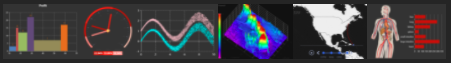
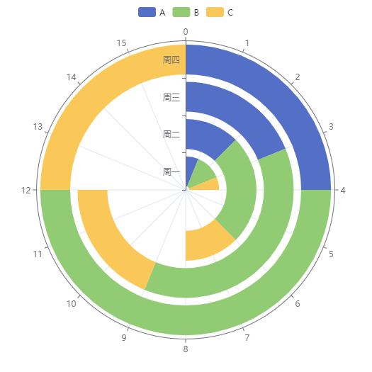
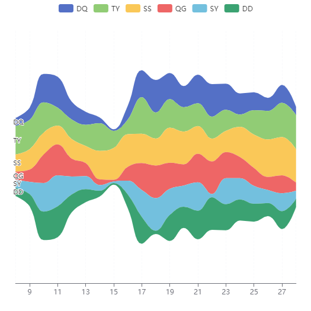
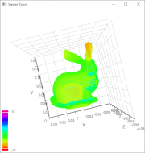
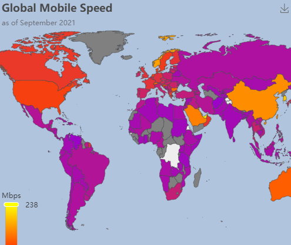

# echarty

[](https://helgasoft.github.io/echarty)

This package is a thin R wrapper around Javascript library
[ECharts](https://echarts.apache.org/en/index.html).  
**One** major command(*ec.init*) uses R lists to support the [ECharts
API](https://echarts.apache.org/en/option.html).  
Benefit from ECharts **full functionality** and build interactive charts
in R and Shiny with minimal overhead.

Wider connectivity and deployment potential through
[WebR](https://helgasoft.github.io/echarty/test/coder.html) and
[crosstalk](https://rpubs.com/echarty/crosstalk).

**Compare to echarts4r** 📌

| R package                                                                                                        | echarts4r                                                                                                                                                                 | echarty                                                                                                                                                               |
|------------------------------------------------------------------------------------------------------------------|---------------------------------------------------------------------------------------------------------------------------------------------------------------------------|-----------------------------------------------------------------------------------------------------------------------------------------------------------------------|
| initial commit                                                                                                   | Mar 12, 2018                                                                                                                                                              | Feb 5, 2021                                                                                                                                                           |
| library size                                                                                                     |                                                                                       |                                                                                          |
| test coverage                                                                                                    | [](https://coveralls.io/github/JohnCoene/echarts4r) | [](https://coveralls.io/github/helgasoft/echarty) |
| lines of code                                                                                                    | 1,202,681 [](https://api.codetabs.com/v1/loc/?github=JohnCoene/echarts4r)                                                  | 6,951 [](https://api.codetabs.com/v1/loc?github=helgasoft/echarty)                                                     |
| echarts.js version                                                                                               | 5.4.3 [](https://github.com/JohnCoene/echarts4r/blob/master/inst/htmlwidgets/lib/echarts-4.8.0/echarts-en.min.js)          | 6.0.0 [](https://github.com/helgasoft/echarty/blob/main/inst/js/echarts.min.js)                                        |
| API design                                                                                                       | own commands with parameters                                                                                                                                              | mostly [ECharts option](https://echarts.apache.org/en/option.html) lists ⁽¹⁾                                                                                          |
| number of commands                                                                                               | over [200](https://echarts4r.john-coene.com/reference/)                                                                                                                   | **one** command (ec.init) + optional utility commands                                                                                                                 |
| [dataset](https://echarts.apache.org/en/option.html#dataset) support                                             | no                                                                                                                                                                        | **yes**                                                                                                                                                               |
| [WebR](https://docs.r-wasm.org/webr/latest/) support                                                             | no                                                                                                                                                                        | **yes**                                                                                                                                                               |
| [crosstalk](https://rstudio.github.io/crosstalk/) support                                                        | no                                                                                                                                                                        | **yes**                                                                                                                                                               |
| column-to-style                                                                                                  | no                                                                                                                                                                        | **yes**                                                                                                                                                               |
| dependencies ([tools](https://www.rdocumentation.org/packages/tools/versions/3.6.2/topics/package_dependencies)) | 70                                                                                                                                                                        | 46                                                                                                                                                                    |
| dependencies ([WebR](https://repo.r-wasm.org))                                                                   | 188                                                                                                                                                                       | 46                                                                                                                                                                    |

⁽¹⁾ We encourage users to follow the original ECharts API to construct
charts with echarty. This differs from echarts4r which uses own commands
for most chart options.

Comparison review done October 2025 for current versions of echarts4R
and echarty.  
\_\_\_

Please consider granting a Github star ⭐ to show your support.

## Installation

Latest development build **1.7.2**

``` r
if (!requireNamespace('remotes')) install.packages('remotes')
remotes::install_github('helgasoft/echarty')
```

[](https://cran.r-project.org/package=echarty)
From [CRAN](https://CRAN.R-project.org):

``` r
install.packages('echarty')
```

## Examples

``` r
library(echarty); library(dplyr)

#  scatter chart (default)
cars |> ec.init()

#  parallel chart
ToothGrowth |> ec.init(ctype= 'parallel')

#  3D chart with GL plugin
iris |> group_by(Species) |> ec.init(load= '3D')

#  timeline of two series with grouping, formatting, autoPlay
iris |> group_by(Species) |> 
ec.init(
  timeline= list(autoPlay= TRUE),
  series.param = list(
    symbolSize= ec.clmn('Petal.Width', scale= 9),
    encode= list(x= 'Sepal.Width', y='Petal.Length'),
    markLine= list(data= list(list(type='max'), list(type='min')))
  )
)

# show a remote map chart, needs package leaflet installed
echarty::ec.fromJson('https://helgasoft.github.io/echarty/test/pfull.json')
```

## Get started

The **Coder** is a good introduction, type
[`library(echarty); demo(coder)`](https://helgasoft.github.io/echarty/).  
The [**WEBSITE**](https://helgasoft.github.io/echarty) has a vast
gallery with code and tutorials.  
The package itself has [code
examples](https://raw.githubusercontent.com/helgasoft/echarty/refs/heads/main/demo/examples.R)
included. Now you can start building [**beautiful
ECharts**](https://echarts.apache.org/examples/en/index.html) with R and
Shiny!

  

[  
](https://helgasoft.github.io/echarty/articles/gallery.html)  
Made with echarty. Powered by ECharts.
