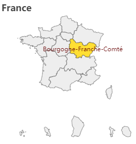
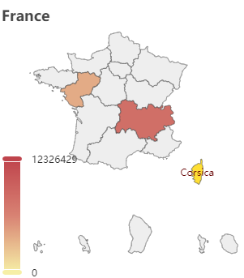
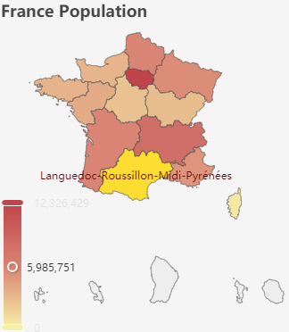

# Use Case 1 - step-by-step tutorial

## Building an interactive map with regional data
\
We'll need a **map**, some **data** - and **echarty** to bring them together.  
Map is France by regions, from [here](https://raw.githubusercontent.com/echarts-maps/echarts-countries-js/master/echarts-countries-js/France.js).  
Data is France population by region, from [here](https://www.ined.fr/en/everything_about_population/data/france/population-structure/regions_departments).  
Let start by initializing the chart, load the map as a plugin and make sure it shows correctly.

```r
library(echarty); library(dplyr)
url <- 'https://raw.githubusercontent.com/echarts-maps/echarts-countries-js/master/echarts-countries-js/France.js'
ec.init(load= url, preset= FALSE,
	series= list(list(type= 'map', map= 'France', roam= TRUE))
)
```

We use *ec.init()* with _preset=FALSE_ since we do not want the default XY axes to show up. The map is loaded as plugin with command *ec.plugjs* or directly with *ec.init*. We set only one option component - 'series', with its parameters *type, map* and *roam* documented [here](https://echarts.apache.org/en/option.html#series-map).
Run the code. The map is installed with some feedback in the Console panel. No error, but also ...no map ??!  
\
The problem is in the **map name**. In the [docs](https://echarts.apache.org/en/option.html#series-map.map) we see that for file 'china.js' they use *map='china'*. So the easy conclusion by analogy would be to set *map='France'* for 'France.js' ?  
Actually map name and file name may have nothing in common. We'll need to dig inside the JS file to find the exact name.  
Open *France.js* in a text editor and look for *'registerMap('*. It turns out the name right after is '法国' - Chinese for 'France'. Let's update the code:

```r
ec.init(load= 'file://France.js', preset= FALSE,
	title = list(text= 'France'),
	series = list(list(type= 'map', map= '法国', roam= TRUE))
)
```

The map has been already installed, so we just load it by name ('file://France.js'). We also add a [title](https://echarts.apache.org/en/option.html#title). Running the updated code results in the following chart  
\
  
\
The map is indeed of France, it's zoomable and we see the regions highlighted on hover.  
Ok, map part done ✔. Data is next (with some surprises).   
Our [data page](https://www.ined.fr/en/everything_about_population/data/france/population-structure/regions_departments) shows a blue table. Source code inspection reveals a data table and we'll use library *rvest* to extract it.  

```r
library(rvest)
wp <- read_html('https://www.ined.fr/en/everything_about_population/data/france/population-structure/regions_departments')
wt <- wp %>% html_node('#para_nb_1 > div > div > div > table') %>% html_table(header=TRUE)
wt
```

We'll have to do some cleanup, like rename columns, remove spaces and summary row. Then try adding the data to the series.<br />

```r
library(rvest)
wp <- read_html('https://www.ined.fr/en/everything_about_population/data/france/population-structure/regions_departments')
wt <- wp %>% html_node('#para_nb_1 > div > div > div > table') %>% html_table(header=TRUE)
names(wt) <- c('region','v1','v2','v3','ppl') # rename columns
wt <- wt[-nrow(wt),]     # delete summary row, contaminates color values
wt$ppl <- as.numeric(gsub('[^\x01-\x7f]', '', wt$ppl))    # remove weird spaces

ec.init(load='file://France.js', preset= FALSE,
	title = list(text= 'France'),
	series = list(list(type='map', map='法国', roam=TRUE,
	   data = lapply(ec.data(wt, 'names'), function(x) list(name= x$region, value= x$ppl))
	)),
	visualMap = list(type= 'continuous', calculable= TRUE, max= max(wt$ppl))
)
```

As you can see, we are using *ec.data()* for data conversion from data.frame to a list. Each row becomes a sublist with *name* and *value*. Name is the region name, and value is the number of people (ppl). <br /> Added also is a *visualMap* which will color the regions depending on their values (population).  
Running above code brings us this chart  
\
 <br /> 
\
Ok, there is some color, but why most of the regions are blank?  
It's again a data problem. The region names from the map and those from the web page do not match completely. It's more difficult to change the map, so we'll update the wt data.frame instead. To replace region names, let use conditional *mutate* from *dplyr*:

```r
library(dplyr); library(rvest)
wp <- read_html('https://www.ined.fr/en/everything_about_population/data/france/population-structure/regions_departments/')
wt <- wp %>% html_node('#para_nb_1 > div > div > div > table') %>% html_table(header=TRUE)
names(wt) <- c('region','v1','v2','v3','ppl') # rename columns
wt$ppl <- as.numeric(gsub(' ','', wt$ppl))    # remove weird(binary) spaces
wt <- wt[-nrow(wt),]     # delete summary row, contaminates color values
wt <- wt %>% mutate(region = case_when(
  region=='Grand Est'       ~'Alsace–Champagne-Ardenne–Lorraine',
  region=='Nouvelle Aquitaine'  ~'Aquitaine-Limousin-Poitou-Charentes',
  region=='Bretagne'        ~'Brittany',                                    
  region=='Île-de-France'   ~'Ile-de-France',
  region=='Occitanie'       ~'Languedoc-Roussillon-Midi-Pyrénées',
  region=='Hauts-de-France' ~'Nord-Pas-de-Calais and Picardy',
  region=='Normandie'       ~'Normandy',
  region=='Centre - Val de Loire'   ~'Centre-Val de Loire',
  region=='Corse'           ~'Corsica',
  region=='Provence-Alpes-Côte d’Azur'  ~"Provence-Alpes-Côte d'Azur",
  region=='Bourgogne- Franche-Comté'    ~'Bourgogne-Franche-Comté',
  TRUE ~ region))

library(echarty)
url <- 'https://raw.githubusercontent.com/echarts-maps/echarts-countries-js/master/echarts-countries-js/France.js'
ec.init(load= url, preset= FALSE,
  title = list(show=TRUE, text='France Population'),
  backgroundColor = 'whitesmoke',
  series = list(list(type='map', map='法国', roam=TRUE,
	data = lapply(ec.data(wt, 'names'), function(x) list(name= x$region, value= x$ppl)) 
  )),
  visualMap = list(type= 'continuous', calculable= TRUE, max= max(wt$ppl),
	formatter = ec.clmn('%L@', -1))		  
)

```

At last we have the final code above. The *visualMap* has been enhanced with a [*formatter*](https://echarts.apache.org/en/option.html#visualMap-continuous.formatter). It shows the *visualMap* values as formatted integers. Sometimes, like in our case, formatters are JS code that needs to be wrapped in *htmlwidgets::JS()* so it can be sent to ECharts for execution. Other [simpler formatters](https://echarts.apache.org/en/option.html#series-scatter.tooltip.formatter) are just strings like *"{a}: {c}"*.  
Note also how the *max* parameter is set. Without it the color range would be out of sync.  
So here is the result of our efforts - a nice map with pan/zoom and value coloring.  
\
  
\
Wasn't too hard, was it? Share your thoughts in [Discussions](https://github.com/helgasoft/echarty/discussions).  
\
\
Oh wait, the boss just got another (always brilliant) idea:  
"Could you get the total population number from the summary row and add it as subtitle?"...

<br />   <br />   <br />   <br />  
