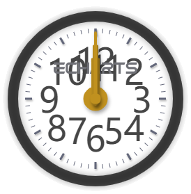
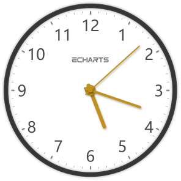

# Use Case 2 - step-by-step tutorial

## Building a clock using echarty's Translation Assistant  
\
Watching the time go by? A little gem from ECharts examples can help - a finely crafted [classical clock](https://echarts.apache.org/examples/en/editor.html?c=gauge-clock).  
Looking at the JS code, we see the usual 'option', but also some functions at the bottom. And that's a lot to rewrite in R! Fortunately, there is a better way:  
Introducing the Echarty Translator Assistant (TA) - run the following R command
```r
echarty::ec.js2r()   # needs version 0.1.1
```
It is a R/Shiny app to help translate data from JS examples to R. Take a moment to familiarize yourself with it and check the **Info** button upper right.  
We copy only the *option* object from ECharts and paste it in TA, then hit Translate and Plot ... and get an error. This is due to the existance of a **formatter** component. We need to find it in *R code* and replace *formatter=function...)),anchor* with *formatter="@@"),anchor*.  
Try *Plot to R* again, we should get the following image  
\

\
\
Better than nothing. Now lets get the original JS function from ECharts and put it back in the formatter the *right way*. The text is here:  
```js
function (value) { if (value === 0) { return ''; } return value; }
```
We need to enclose it in a special function so it could be carried to JS for execution.  
```r
htmlwidgets::JS("function (value) { 
  if (value === 0) { return ''; } return value; }")
```
In *R code* replace *formatter="@@"* with *formatter=\<above code\>* and plot.  
\

\
\
We see numbers now, how wonderful ! Clock is not ticking yet because we still have not applied the JS functions.  
From ECharts code, copy **only** text from "var timeUpdatedStatus..." to the end, and copy it in your text editor. After making sure there are no double quotes, enclose everything in double quotes and set it as an R string, like **jcode<-"..."**.  
Next step is to look for two ECharts objects which have different names in our R environment. Replace **myChart** with **chart**, and **option** with **opts**.  Now select/copy the entire text and paste it on top of *R code* before *p <- ec.init*.
Then replace *p <- ec.init()* with *p <- ec.init(js=jcode)* to load the JS code in *echarty*. Cross fingers and hit *Plot to R* again...  
\

\
\
Let the good times R-R-R-Rolex ™ 👍  
Once you learn those R-to-JS interaction steps, you can dance with any Echart.  
Here is the complete R code  
```r
jcode <- "
var timeUpdatedStatus = {
  second: false,
  minute: false,
  hour: false
};
function updateSeries(time, series, type) {
  var isCritical = (Math.floor(time) === 0) || (type === 'second' && time === 1);
  if (isCritical && timeUpdatedStatus[type] === true) {
    timeUpdatedStatus[type] = false;
    series.data[0].value = 0;
    series.clockwise = true;
    opts.animationDurationUpdate = 0;
    chart.setOption(opts, true);
  }
  series.data[0].value = time;
  series.clockwise = true;
  if (time === 0) {
    timeUpdatedStatus[type] = true;
    series.clockwise = false;
  }
}
setInterval(function () {
  var date = new Date();
  var second = date.getSeconds();
  var minute = date.getMinutes() + second / 60;
  var hour = date.getHours() % 12 + minute / 60;
  
  updateSeries(second, opts.series[2], 'second');
  updateSeries(minute, opts.series[1], 'minute');
  updateSeries(hour, opts.series[0], 'hour');
  
  opts.animationDurationUpdate = 300;
  chart.setOption(opts, true);
  date = null;
}, 1000);"

p <- ec.init(js = jcode)
p$x$opts <- list(
  series = list(
    list(name='hour',type='gauge',startAngle=90,endAngle=-270,min=0,max=12,splitNumber=12,
      axisLine=list(lineStyle=list(width=15,color=list(list(1, 'rgba(0,0,0,0.7)')), shadowColor='rgba(0, 0, 0, 0.5)',shadowBlur=15)),
      splitLine=list(lineStyle=list(shadowColor='rgba(0, 0, 0, 0.3)',shadowBlur=3,shadowOffsetX=1,shadowOffsetY=2)),
      axisLabel=list(fontSize=50,distance=25,
                     formatter=htmlwidgets::JS("function (value) {
                       if (value === 0) { return ''; }
                       return value; }")
      ),
      anchor=list(show=TRUE,icon='path://M532.8,70.8C532.8,70.8,532.8,70.8,532.8,70.8L532.8,70.8C532.7,70.8,532.8,70.8,532.8,70.8z M456.1,49.6c-2.2-6.2-8.1-10.6-15-10.6h-37.5v10.6h37.5l0,0c2.9,0,5.3,2.4,5.3,5.3c0,2.9-2.4,5.3-5.3,5.3v0h-22.5c-1.5,0.1-3,0.4-4.3,0.9c-4.5,1.6-8.1,5.2-9.7,9.8c-0.6,1.7-0.9,3.4-0.9,5.3v16h10.6v-16l0,0l0,0c0-2.7,2.1-5,4.7-5.3h10.3l10.4,21.2h11.8l-10.4-21.2h0c6.9,0,12.8-4.4,15-10.6c0.6-1.7,0.9-3.5,0.9-5.3C457,53,456.7,51.2,456.1,49.6z M388.9,92.1h11.3L381,39h-3.6h-11.3L346.8,92v0h11.3l3.9-10.7h7.3h7.7l3.9-10.6h-7.7h-7.3l7.7-21.2v0L388.9,92.1z M301,38.9h-10.6v53.1H301V70.8h28.4l3.7-10.6H301V38.9zM333.2,38.9v10.6v10.7v31.9h10.6V38.9H333.2z M249.5,81.4L249.5,81.4L249.5,81.4c-2.9,0-5.3-2.4-5.3-5.3h0V54.9h0l0,0c0-2.9,2.4-5.3,5.3-5.3l0,0l0,0h33.6l3.9-10.6h-37.5c-1.9,0-3.6,0.3-5.3,0.9c-4.5,1.6-8.1,5.2-9.7,9.7c-0.6,1.7-0.9,3.5-0.9,5.3l0,0v21.3c0,1.9,0.3,3.6,0.9,5.3c1.6,4.5,5.2,8.1,9.7,9.7c1.7,0.6,3.5,0.9,5.3,0.9h33.6l3.9-10.6H249.5z M176.8,38.9v10.6h49.6l3.9-10.6H176.8z M192.7,81.4L192.7,81.4L192.7,81.4c-2.9,0-5.3-2.4-5.3-5.3l0,0v-5.3h38.9l3.9-10.6h-53.4v10.6v5.3l0,0c0,1.9,0.3,3.6,0.9,5.3c1.6,4.5,5.2,8.1,9.7,9.7c1.7,0.6,3.4,0.9,5.3,0.9h23.4h10.2l3.9-10.6l0,0H192.7z M460.1,38.9v10.6h21.4v42.5h10.6V49.6h17.5l3.8-10.6H460.1z M541.6,68.2c-0.2,0.1-0.4,0.3-0.7,0.4C541.1,68.4,541.4,68.3,541.6,68.2L541.6,68.2z M554.3,60.2h-21.6v0l0,0c-2.9,0-5.3-2.4-5.3-5.3c0-2.9,2.4-5.3,5.3-5.3l0,0l0,0h33.6l3.8-10.6h-37.5l0,0c-6.9,0-12.8,4.4-15,10.6c-0.6,1.7-0.9,3.5-0.9,5.3c0,1.9,0.3,3.7,0.9,5.3c2.2,6.2,8.1,10.6,15,10.6h21.6l0,0c2.9,0,5.3,2.4,5.3,5.3c0,2.9-2.4,5.3-5.3,5.3l0,0h-37.5v10.6h37.5c6.9,0,12.8-4.4,15-10.6c0.6-1.7,0.9-3.5,0.9-5.3c0-1.9-0.3-3.7-0.9-5.3C567.2,64.6,561.3,60.2,554.3,60.2z',
            showAbove=FALSE,offsetCenter=list(0, '-35%'),size=120,keepAspect=TRUE,itemStyle=list(color='#707177')),
      pointer=list(icon='path://M2.9,0.7L2.9,0.7c1.4,0,2.6,1.2,2.6,2.6v115c0,1.4-1.2,2.6-2.6,2.6l0,0c-1.4,0-2.6-1.2-2.6-2.6V3.3C0.3,1.9,1.4,0.7,2.9,0.7z',width=12,length='55%',offsetCenter=list(0, '8%'),itemStyle=list(color='#C0911F',shadowColor='rgba(0, 0, 0, 0.3)',shadowBlur=8,shadowOffsetX=2,shadowOffsetY=4)),detail=list(show=FALSE),title=list(offsetCenter=list(0, '30%')),data=list(list(value=0))
    ),
    list(name='minute',type='gauge',startAngle=90,endAngle=-270,min=0,max=60,
       axisLine=list(show=FALSE),splitLine=list(show=FALSE),axisTick=list(show=FALSE),
       axisLabel=list(show=FALSE), pointer=list(icon='path://M2.9,0.7L2.9,0.7c1.4,0,2.6,1.2,2.6,2.6v115c0,1.4-1.2,2.6-2.6,2.6l0,0c-1.4,0-2.6-1.2-2.6-2.6V3.3C0.3,1.9,1.4,0.7,2.9,0.7z',width=8,length='70%',offsetCenter=list(0, '8%'),itemStyle=list(color='#C0911F',shadowColor='rgba(0, 0, 0, 0.3)',shadowBlur=8,shadowOffsetX=2,shadowOffsetY=4)),
       anchor=list(show=TRUE,size=20,showAbove=FALSE,itemStyle=list(borderWidth=15,borderColor='#C0911F',shadowColor='rgba(0, 0, 0, 0.3)',shadowBlur=8,shadowOffsetX=2,shadowOffsetY=4)),detail=list(show=FALSE),title=list(offsetCenter=list('0%', '-40%')),data=list(list(value=0))),
    list(name='second',type='gauge',startAngle=90,endAngle=-270,min=0,max=60,animationEasingUpdate='bounceOut',
       axisLine=list(show=FALSE),splitLine=list(show=FALSE),axisTick=list(show=FALSE),
       axisLabel=list(show=FALSE), pointer=list(icon='path://M2.9,0.7L2.9,0.7c1.4,0,2.6,1.2,2.6,2.6v115c0,1.4-1.2,2.6-2.6,2.6l0,0c-1.4,0-2.6-1.2-2.6-2.6V3.3C0.3,1.9,1.4,0.7,2.9,0.7z',width=4,length='85%',offsetCenter=list(0, '8%'),itemStyle=list(color='#C0911F',shadowColor='rgba(0, 0, 0, 0.3)',shadowBlur=8,shadowOffsetX=2,shadowOffsetY=4)),
       anchor=list(show=TRUE,size=15,showAbove=TRUE,itemStyle=list(color='#C0911F',shadowColor='rgba(0, 0, 0, 0.3)',shadowBlur=8,shadowOffsetX=2,shadowOffsetY=4)),detail=list(show=FALSE),title=list(offsetCenter=list('0%', '-40%')),data=list(list(value=0)))
))
p
```
