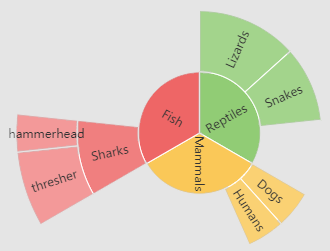
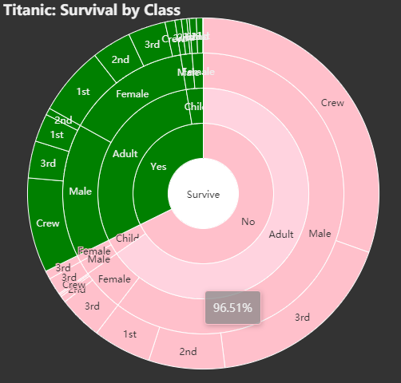

# Use Case 3 -  Hierarchies in R and echarty  

There are several types of charts to represent hierarchical structures - sunburst, tree, treemap, sankey, graph.
Hierarchical data in R can be built with:
- list of lists - read as is
- data.frame with nested data.frame children - read thru _jsonlite::toJSON_
- data.frame with parent & child columns - read thru _ec.data(format='treePC')_
- data.frame with a column for each level, like Titanic data - read thru  _ec.data(format='treeTK')_

Many users find the **third** representation most intuitive and straightforward.    
Note the difference in data setting for chart *tree* compared to *sunburst* and *treemap*.  *Tree*'s data is the top-level node, while *sunburst* and *treemap* use the first lower level.
Below are examples for all four types.  
<br />

## List of lists

```r
data <- list(
	list(name='Grandpa', 
		children=list(
			list(name='Uncle Leo', value=15,
		 		children= list(list(name='Cousin Jack',value=2), 
			  			list(name='Cousin Mary',value=5,
			  				children=list(list(name='Jackson',value=2))), 
		  						list(name='Cousin Ben',value=4))),
		list(name='Father', value=10,
		  	children= list(list(name='Me',value=5),
		  					list(name='Brother Peter',value=1))))),
	list(name='Nancy',
		  children= list(list(name='Uncle Nike',
  						children=list(list(name='Cousin Betty',value=1), 
  							list(name='Cousin Jenny',value=2)))))
)
# -------------------------------------------------

ec.init(preset= FALSE,
		series= list(list(
		  	type= 'sunburst', data= data, 
            radius= list(0, '90%'), label= list(rotate='radial')))
)
```
<br />

## Data frame with nested data.frame children

```r
animl <- data.frame(name = "Animals", value = 255)  # top level
animl$children <- 
	list(data.frame(name = c("Mammals", "Reptiles","Fish"), value = c(100,90,60)))
animl$children[[1]]$children <- c(
 	list(data.frame(name = c("Dogs", "Humans"), value = c( 15, 35))),
 	list(data.frame(name = c("Snakes", "Lizards"), value = c(30, 40))),
 	list(data.frame(name = c("Sharks"), value = 30)) )
animl$children[[1]]$children[[3]]$children <- 
	list(data.frame(name = c("hammerhead", "thresher"), value = c(10,20)))
# -------------------------------------------------

ec.init(preset=FALSE,
	series= list(list(type= 'tree', 
	  data= jsonlite::toJSON(animl), 
	  label= list(offset=c(0, -12)), 
	  symbolSize= htmlwidgets::JS("function(d) { return d; }")  # size by value
)))

ec.init(preset=FALSE,
	series= list(list(type= 'treemap', 
	  data=jsonlite::toJSON(animl), leafDepth=1)) 
)

ec.init(preset= FALSE,
	series= list(list(type= 'sunburst', 
	  data=jsonlite::toJSON(animl$children[[1]]), 
		radius=c(0, '90%'), label=list(rotate='radial') ))
)

```
<br />

## Data frame with parent-child columns

```r
df <- data.frame(
    parents = c("","Reptiles", "Reptiles", "Mammals", "Mammals", "Fish", "Sharks", "Sharks", "Animals", "Animals", "Animals"),
	children = c("Animals", "Snakes", "Lizards", "Dogs", "Humans", "Sharks", "hammerhead", "thresher", "Reptiles", "Mammals", "Fish"),
	value = c(255, 30, 40, 15, 35, 30, 10, 20, 90, 100, 60)) 
df <- ec.data(df, format='treePC')

ec.init(preset= FALSE,
	series= list(list(type= 'sunburst', 
		data= df[[1]]$children,  # =df
		radius= c(0, '90%'), label=list(rotate='radial'), emphasis=list(focus='ancestor') ))
)
ec.init(preset= FALSE,
	series= list(list(type= 'tree', 
	  	data= df, 
	  	label= list(offset = c(0, -12)), symbolSize= ec.clmn() ))  # size by value
)
ec.init(preset= FALSE,
	series= list(list(type= 'treemap', 
	  	data= df[[1]]$children, # =df, leafDepth=1, 
	  	label= list(offset = c(0, -12)), symbolSize= ec.clmn() )),
	tooltip= list(show= TRUE)
)
```


<br /><br />

## Data frame with a column for each level

```r
# build required pathString and optional itemStyle columns
df <- as.data.frame(Titanic) |> 
    group_by(Survived,Age,Sex,Class) |> 
    summarise(value= sum(Freq), .groups= 'drop') |> 
    rowwise() |>
    mutate(pathString= paste('Survive', Survived, Age, Sex, Class, sep='/'),
            itemStyle= case_when(Survived=='Yes' ~ "color='green'", TRUE ~ "color='pink'")) |>
    select(pathString, value, itemStyle)

dat <- ec.data(df, format='treeTK')
dat[[1]] <- within(dat[[1]], { itemStyle <- list(color= 'white'); pct <- 0 })  # customize top

ec.init(preset= FALSE,
	title= list(text= 'Titanic: Survival by Class'),
	tooltip= list(formatter= ec.clmn('%@%','pct')),
	series= list(list(
	  type= 'sunburst', radius= c(0, '90%'), label= list(rotate=0),
	  # type= 'tree', symbolSize= ec.clmn(scale=0.08),
	  # type= 'treemap', upperLabel= list(show=TRUE, height=30), itemStyle= list(borderColor= '#999'), #leafDepth=4,
	  data= dat,
	  emphasis= list(focus='none') 
	))
)
```
