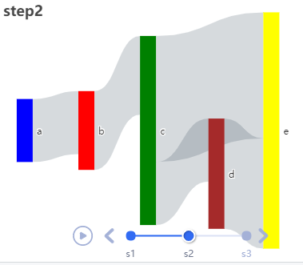

# Use Case 4 - Sankey with timeline
<br />

Will sankey chart work with timeline ? An interesting question by [rdatasculptor](https://github.com/rdatasculptor).  
To speed things up, we go to echarty's examples. In the Console type **?ec.examples**, then in Help panel, hit Ctrl/F and seach for 'sankey'. We find the following code  
<br />

```r
#------ Sankey and graph plots
sankey <- data.frame(
  node   = c("a","b", "c", "d", "e"),
  source = c("a", "b", "c", "d", "c"),
  target = c("b", "c", "d", "e", "e"),
  value  = c(5, 6, 2, 8, 13)
)
data <- ec.data(sankey, 'names')

ec.init(preset= FALSE,
        series= list(list(
          type= 'sankey',
          data= lapply(data, function(x) list(name= x$node)),
          edges= data ))
)
```

Sankey chart data consists of nodes connected by edges having a value. If the data is defined as *data.frame*, we need to transform it into a list with command *ec.data()*. Once in that format, we can access the columns by index - *node* is value[1], ..., *value* is value[4]. The [edges](https://echarts.apache.org/en/option.html#series-sankey.edges) definition requires three parameters - source, target and value.  

Now let's add [timeline](https://echarts.apache.org/en/option.html#timeline). Timeline is just a collection of data states targeted to some chart. An animated display shows the chart transition from one state to the next.  
We will **not** try to change nodes or edges on each step, just **edge values**. Let's have three states(steps) and build three edge lists with slightly different values - edges1, edges2, edges3. That wraps up the data preparation.  

The GUI part starts with chart initialization with *ec.init()*, then setting chart parameters which here are series, timeline and options.  
Parameter *timeline* defines labels for the timeline legend.  
Parameter *options* (ill-named) defines the timeline series.  
Note: command *ec.init* can set timeline options through parameter *tl.series*, but that requires grouped dataframe data, which is not the case in this example.  
The complete code is below. We've added also series *levels* to fine-tune visuals on each step, especially colors. Without *levels* node colors would change on each step, which is confusing. 
<br />
<br />

```r
sankey <- data.frame(
  node = c("a","b", "c", "d", "e"),
  source = c("a", "b", "c", "d", "c"),
  target = c("b", "c", "d", "e", "e"),
  value = c(5, 3, 2, 8, 13)
)
# prepare timeline state data
st <- function() ec.data(sankey, 'values')  # data.frame to list
nodes <- lapply(st(), function(x) list(name = x$value[1]))
edo <- function(x) list(source=as.character(x$value[2]),  
                        target=as.character(x$value[3]), value=x$value[4])
edges <- list()
edges[[1]] <- lapply(st(), edo)
sankey$value <- c(4, 5, 4, 7, 8)
edges[[2]] <- lapply(st(), edo)
sankey$value <- c(2, 7, 6, 5, 4)
edges[[3]] <- lapply(st(), edo)

options <- list()
for(i in 1:3) {
  options <- append(options,
    list(list(title = list(text=paste0('step',i)), 
              series= list(list(type='sankey', data=nodes, edges=edges[[i]]))))
  )
}
# optional serie levels to keep colors persistent
i <- -1
levcol = lapply(list('blue','red','green','brown','yellow'),
		 function(clr) { i<<-i+1; list(depth=i, itemStyle=list(color=clr)) })

p <- ec.init(preset=FALSE)
p$x$opts <- list(
	series = list(list(type='sankey', data = nodes, edges = edges[[1]], levels = levcol	)),
  timeline = list(axisType='category', data=list('s1','s2','s3')),
  options = options
)
p
```



<br/>
<br />

So the final answer is **yes** - sankey and timeline work together just fine.  
For more *sankey* customizations check [this ECharts example](https://echarts.apache.org/examples/en/editor.html?c=sankey-levels).  
<br/>


