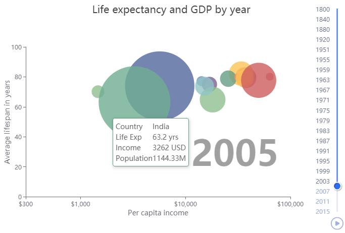

# Use Case 4 - Bubbles and troubles with JavaScript

Echarts being a JavaScript library, dealing with JS code sometimes becomes unavoidable. For instance replicating [this interesting example](https://echarts.apache.org/examples/en/editor.html?c=scatter-life-expectancy-timeline) in R requires serious work in both languages.  
\
The chart presents life expectancy and GDP for 19 countries in one century timeframe. There are 81 recorded years from 1800 to 2015. One serie per year per country contains 5 values - income, life expectancy, population, country and year. 
```r
> str(tmp)  # data from downloaded JSON file
List of 3
 $ counties: chr [1:19] "China" "United States" "United Kingdom" ...
 $ timeline: int [1:81] 1800 1810 1820 1830 1840 1850 1860 ...
 $ series  : chr [1:81, 1:19, 1:5] "815" "834" "853" "1399" ...
```
We analyze the data preparation and whether it is doable in R. This block is at the bottom of the JS source. It builds timeline options in a loop. In R, we can do the same with *lapply*.  
Note how *symbolSize* is set as a JS function. This is the only way to make it proportional to the country's population, as *val[2]* is the third (0,1,2) data column, which is Population.  
The only other JS function used is for the tooltip formatter - *jcode*. There we changed the HTML layout a bit to make it more table-like.  
One good trick to mention is the way *series* is set in *p$x$opts*. We have *options* built for all timeline points. It contains all series already, so we can just assign the first one to *series* in *p$x$opts*.  
Final step is to translate the few titles/names from Chinese to English, easily done with [Google](http://translate.google.com/). Below is the entire code. Again *echarty*'s overhead comes down to exactly **one** command - *ec.init()*.  
<br />

```r
jcode <- "function (obj) {
      var schema = [
          {name: 'Income', index: 0, text: 'Income', unit: ' USD'},
          {name: 'LifeExpectancy', index: 1, text: 'Life Exp', unit: ' yrs'},
          {name: 'Population', index: 2, text: 'Population', unit: 'M'},
          {name: 'Country', index: 3, text: 'Country', unit: ''}
      ];
      var value = obj.value;
      return '<div style=\"display: flex;justify-content: space-between;\">' + 
        '<div>' + schema[3].text + '<br/>' + schema[1].text + '<br/>' + schema[0].text + '<br/>' + schema[2].text + '</div>' +
        '<div>' + value[3] + '<br/>' + value[1] + schema[1].unit + '<br/>' + value[0] + schema[0].unit + '<br/>' 
                + value[2] + schema[2].unit + '</div></div>';
    }"

# data download and preparation
tmp <- jsonlite::fromJSON('https://echarts.apache.org/examples/data/asset/data/life-expectancy.json')
tmp$series[,,2] <- round(as.numeric(tmp$series[,,2]), 1)  # lifeExp rounded
tmp$series[,,3] <- round(as.numeric(tmp$series[,,3])/1000000, 2)  # pop in Millions

# build timeline options
i <- 0
options <- lapply(tmp$timeline, function(x) { i <<- i+1; list(
  title = list(text = x), 
  series = list(
    type = 'scatter', name = x, itemStyle=list(opacity= 0.8),
    data = tmp$series[i,,],
    symbolSize = htmlwidgets::JS("function(val) { var y = Math.sqrt(parseInt(val[2]) / 5e2) + 0.1; return y * 80;}")
)) })

# chart settings, translated from JS with ec.js2r() + manual editing
p <- ec.init()
p$x$opts <- list(
  timeline = list(
    axisType = "category", orient = "vertical", 
    autoPlay = FALSE, inverse = TRUE, playInterval = 1000, left = NULL, right = 0, top = 20, bottom = 20, 
    width = 55, height = NULL, symbol = "none", checkpointStyle = list(borderWidth = 2), 
    controlStyle = list(showNextBtn = FALSE, showPrevBtn = FALSE), 
    data = unlist(tmp$timeline)), 
  title = list(list(left="55%", top="55%", textStyle=list(fontSize=70, color='#11111166')), 
               list(text = "Life expectancy and GDP by year", 
                    left = "center", top = 10, textStyle = list(fontWeight = "normal", fontSize = 20))), 
  tooltip = list(padding = 5, borderWidth = 1, formatter = htmlwidgets::JS(jcode)), 
  grid = list(top = 100, containLabel = TRUE, left = 30, right = 110), 
  xAxis = list(type = "log", name = "Per capita income", max = 1e+05, min = 300, nameGap = 25, 
               nameLocation = "middle", nameTextStyle = list(fontSize=14), splitLine=list(show=FALSE), 
               axisLabel = list(formatter = "${value}")), 
  yAxis = list(type = "value", name="Average lifespan in years", 
               nameRotate=90, nameLocation='middle',  nameGap = 30,
               max = 100, nameTextStyle = list(fontSize=14), splitLine = list(show=FALSE)),
  visualMap = list(show = FALSE, dimension = 3, categories = unlist(unique(tmp$counties)) 
        ,inRange = list(color = rep(c('#51689b', '#ce5c5c', '#fbc357', '#8fbf8f', '#659d84',
         '#fb8e6a', '#c77288', '#786090', '#91c4c5', '#6890ba'),2))
  ),
  series = list(options[[1]]$series), 
  animationDurationUpdate = 1000, animationEasingUpdate = "quinticInOut", 
  options = options)
p    # %>% ec.inspect()
```
<br/>


<br/>
