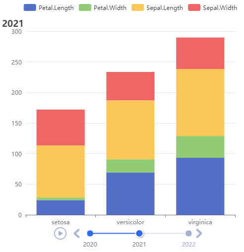

# Use Case 6 - Grouped, stacked and timelined
<br />

Here is a good example of the data-driven nature of ECharts.  
With **chart data** well built, the actual chart display is trivial. It is like having a painting already drawn and framed, all that's needed is a nail and hammer to put it on the wall. One may think of *echarty* as the nail - a final step before display.  
A few noticeable details
- columns could be rearranged to match the two axes, first column is X, second is Y
- initializing *ec.init()* with grouped data presets the [dataset](https://echarts.apache.org/en/option.html#dataset) and [legend](https://echarts.apache.org/en/option.html#legend). Here *dataset* is not used, but *legend* is. Otherwise we would have just <code>p<-ec.init()</code>
- nested grouping with *lapply* is easy!
- option series data is converted from data.frame to a list with *ec.data()*
- with [timeline](https://echarts.apache.org/en/option.html#timeline) and [options](https://echarts.apache.org/en/option.html#options) present, there is no need to set single [chart series](https://echarts.apache.org/en/option.html#series)

<!--
During the making of this example we confirmed an important fact. In current ECharts v.5, **option series** work only with [data](https://echarts.apache.org/en/option.html#series-bar.data), but not with [datasets](https://echarts.apache.org/en/option.html#dataset). So although tempting, [datasetIndex](https://echarts.apache.org/en/option.html#series-bar.datasetIndex) cannot be used in option series. 
-->

Data *vv* credit goes to [vituri](https://vituri.github.io).
```r
library(echarty);  library(dplyr)
vv = iris |> mutate(Year = rep(2020:2022, 50)) |> 
  tidyr::pivot_longer(cols = Sepal.Length:Petal.Width) |> 
  group_by(Year, Species, name) |> 
  summarise(value = sum(value))
# rearrange columns for axes: X = Species (1st), Y = value (2nd)
vv <- vv |> relocate(Species,value) |> mutate(Species=as.character(Species))
options <-  lapply(vv |> group_by(Year) |> group_split(), function(y) {
  series <- lapply(y |> group_by(name) |> group_split(), function(s) {
     list(type = 'bar', stack = 'grp', data = ec.data(s,'values'))
  })
  list(title=list(text=unique(y$Year), top=30), series = series)
})

vv |> group_by(name) |> ec.init(
	timeline= list(data=unique(vv$Year), axisType='category'),
	options= options
)
```
<br />

<br />